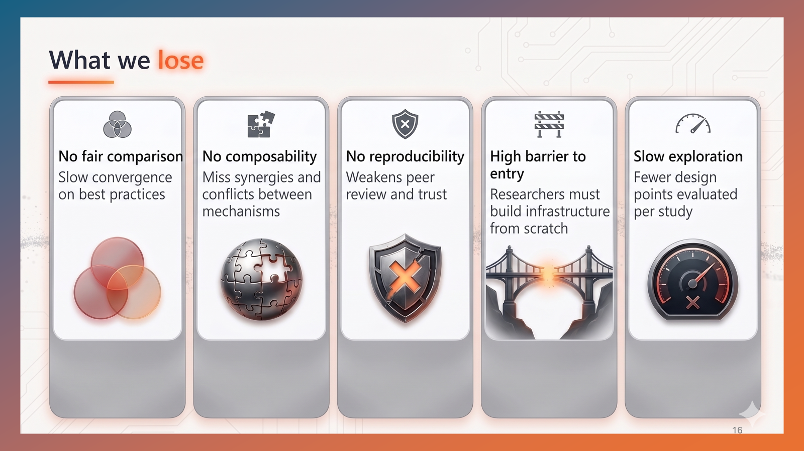
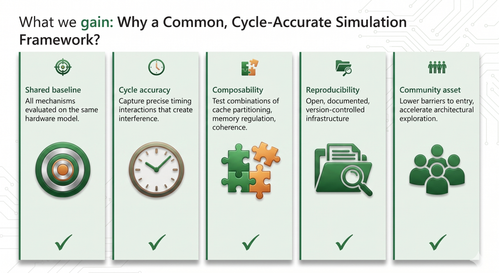
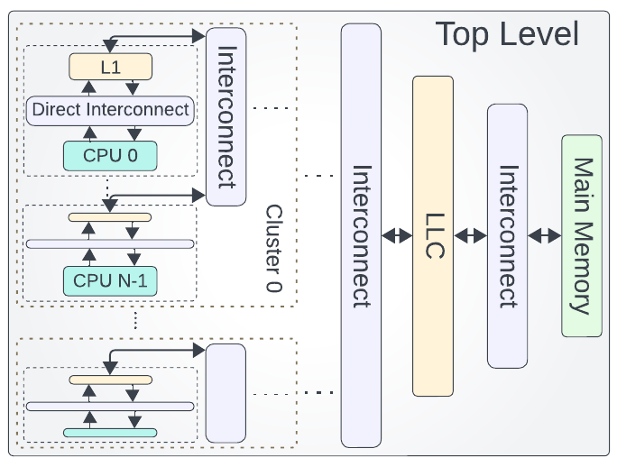
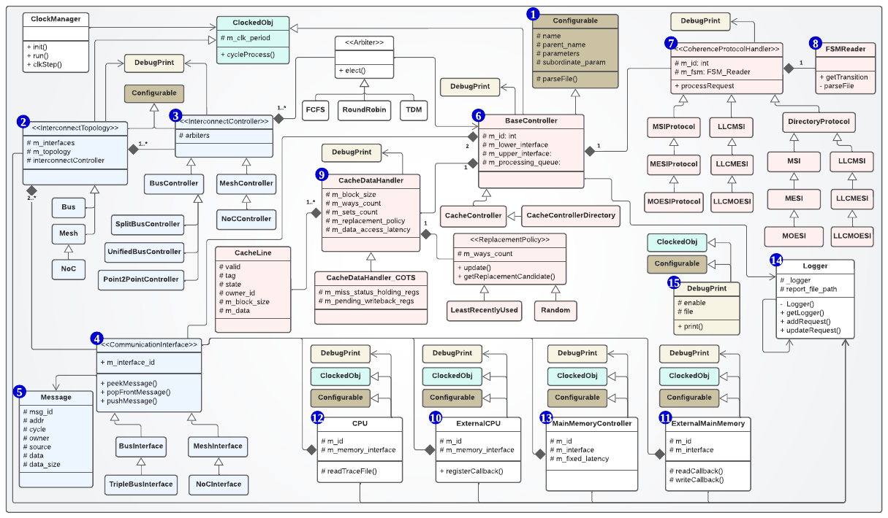
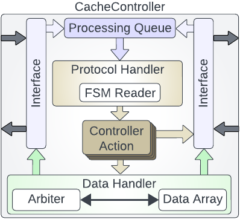
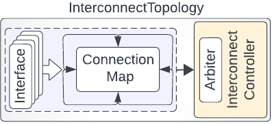
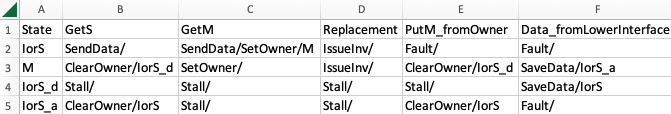
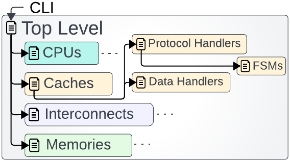

<p align="center">
  
</p>

# Octopus
Octopus is a cycle-accurate cache system simulator with flexible interconnect models. It simulates various cache system and interconnect components, including controllers, data arrays, coherence protocols, and arbiters. Octopus enables the user to build reconfigurable simulation infrastructure for multicore processor chip with a high degree of flexibility of controlling system's configuration parameters. Octopus is implemented in C++ using object-oriented programming concepts to support a modular, expansible, configurable, and integrable design.

### The problem — why the field needs a common framework


### The solution — Octopus


# Documentation
* **[Supported configurations & features](SUPPORTED_CONFIGURATIONS.md)** — the full capability matrix: coherence protocols, interconnect topologies, bus arbitration, cache hierarchy, memory systems (incl. MCsim), operating/integration modes, predictable caching, and monitoring.
* **[Architecture deep-dive](docs/Architecture.md)** — how the clocked, configurable components fit together, the CSV-FSM coherence engine, a request's end-to-end journey, and how to extend the tool.
* **[Adding a coherence protocol](docs/AddingAProtocol.md)** — a worked example: implement **MI** (Modified/Invalid) as a CSV finite-state machine with no C++ and no recompile, with the MI-vs-MESI coherence trace.
* **Monitoring internals:** [Logger](docs/Logger.md) (per-request, per-stage latency + worst-case) · [Debugger](docs/Debugger.md) (filterable component/coherence tracing).
* **[Reproducing the results](REPRODUCIBILITY.md)** — from a fresh clone to every figure and table via configuration-only changes; includes the paper artifact map. See also [`sweeps/README.md`](sweeps/README.md).
* **[Results & figures](results/)** — pre-generated sweep CSVs and the paper figures; [`results/README.md`](results/README.md) explains the layout, columns, and figure-to-paper mapping.
* **[Publications built on Octopus](PUBLICATIONS.md)** — peer-reviewed works that were evaluated on Octopus or re-implemented in it (continuously updated).

# Architecture

Octopus is built from modular, **clocked** components that are *configured, not
hard-coded*, and connected through bounded, back-pressured interfaces. The
diagrams below (from the Octopus CAL paper) explain the design; the full
capability matrix is in [`SUPPORTED_CONFIGURATIONS.md`](SUPPORTED_CONFIGURATIONS.md).

### System organization



A configurable multi-core system: clusters of CPU cores, each with private caches
joined by a direct interconnect, connected through configurable interconnects to a
shared last-level cache (LLC) and main memory. Hierarchy depth, private/shared
placement, topology, and per-level parameters are all set by configuration.

### Class design (UML)



Every simulation entity derives from `Configurable` (hierarchical parameters) and
`ClockedObj` (cycle-stepped by the `ClockManager`). Coherence is a
`CoherenceProtocolHandler` driven by an `FSMReader`; an interconnect is an
`InterconnectTopology` + `InterconnectController` + `Arbiter`; a cache splits into a
`CacheController` and a `CacheDataHandler`. New protocols, arbiters, topologies, and
replacement policies are added by subclassing — or, for coherence, by editing a CSV.

### Inside a cache controller



Messages enter the processing queue; the **protocol handler** interprets the CSV FSM
through the **FSM reader** and emits controller actions; the **data handler** serves
the arrays via a replacement policy, MSHRs, a write-back buffer, and a port arbiter.

### Interconnect



An interconnect is an `InterconnectTopology` (message-holding *interfaces* plus a
*connection map*) and an `InterconnectController` whose *arbiter* resolves contention
on shared links. Swapping the topology/controller yields point-to-point, unified bus,
split bus, mesh, or NoC.

### Coherence as an editable CSV finite-state machine



Each coherence protocol is a finite-state machine stored as a **CSV table**: rows are
(stable and transient) states, columns are coherence events, and each cell is the
action(s) and next state. Adding or modifying a protocol is a spreadsheet edit — no
C++ change and no recompilation.

### Hierarchical configuration



Configuration propagates from the CLI through the top-level module down to every
sub-component and FSM; parameters are inherited, overridden, and extended. This is
what lets a single build sweep the entire design space
(see [`REPRODUCIBILITY.md`](REPRODUCIBILITY.md)).

> **Deeper dive:** [`docs/Architecture.md`](docs/Architecture.md) walks through the clock model, the coherence engine, a request's end-to-end journey, the integration modes, and how to add new protocols and components.

# Citation
If you use this simulator in your work, please consider cite:


Hossam, Mohamed, Salah Hessien, and Mohamed Hassan. "Octopus: a Cycle-Accurate Cache System Simulator." IEEE Computer Architecture Letters (2024). [Octopus](https://ieeexplore.ieee.org/iel8/10208/10700665/10633788.pdf?casa_token=2ABvIsydo2gAAAAA:hsgmaeaOe9CCwKII0mMr86OjOAPGSbHmI-9uq2-vg0GLbnT9YLhiS-nN1RYYT4d8jV2cmhsJQrs).

# Getting started
* The simulator is tested on both Linux Ubuntu 18.04.4 LTS and Ubuntu 20.04.01 releases. You may consider using Virtual Machine VM to install Ubuntu on your machine if it is not your primary operating system.  
* `$Octopus` refers to the top level directory where Octopus resides.
* Directory `$Octopus/src/` contains the source code of the simulator.
* Directory `$Octopus/header/` contains the header files.
* Directory `$Octopus/Protocols_FSM/` contains the CSV files that defines the coherency protocols' finite state machines.
* Directory `$Octopus/configuration/` contains the CSV files that contains the configuratable parameters of the simulation components.

## Building Octopus
Octopus uses CMake to manage the build system of the simulator. In order to build Octopus, you need to install the following:

```shell
sudo apt update
sudo apt upgrade
sudo apt-get install build-essential cmake
```

In order to build the simulator, we create a directory `$Octopus/build/`

```shell
mkdir $Octopus/build/
cd $Octopus/build/
cmake ../ .
make
```

Building for debug will require an extra flag to CMake

```shell
cd $Octopus/build/
cmake ../ . --DCMAKE_BUILD_TYPE=Debug
make
```

## Running Octopus

Running the simulator requires to choose a system configuration to run and a workload. In the example, we choose to run MultiCoreSystem with the workload TestBM in `$Octopus/BMs/TestBM/`. `$Octopus` should be replaced with the full path of the simulator's directory.

```shell
cd $Octopus/build/
./Octopus_Simulator -s MultiCoreSystem -p "workload_path(s)=$Octopus/BMs/TestBM/"
```
`-s` is used to specify the configuration, and `-p` is to overwrite any parameter in the configuration.

The default output reports will be found in `$Octopus/BMs/TestBM/newLogger/`.
