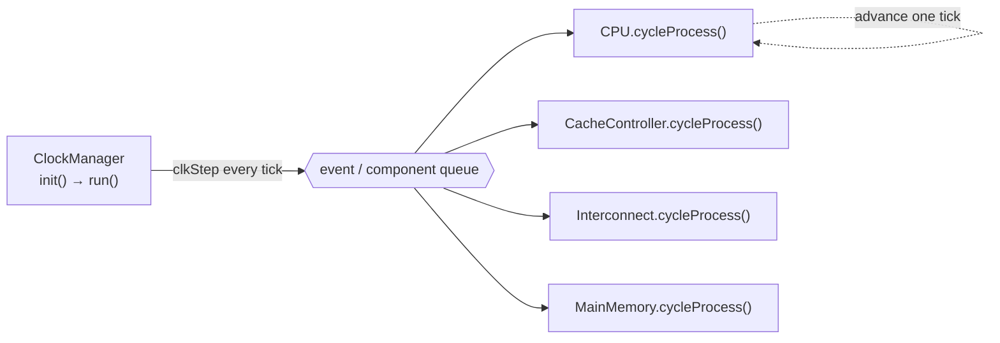
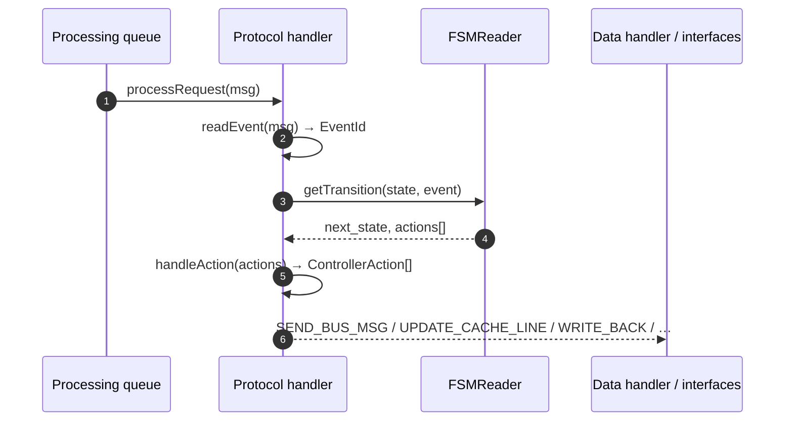
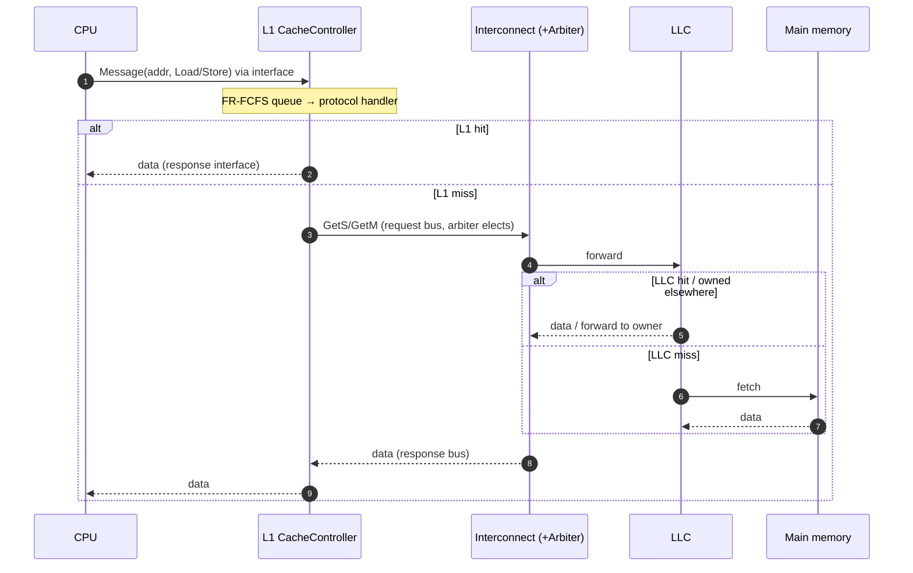

# Octopus Architecture

> Source: [`header/`](../header) and [`src/`](../src). Key entry points:
> [`FSMReader`](../header/FSMReader.h), [`MSIProtocol`](../src/Protocols/MSIProtocol.cpp),
> [`BaseController`](../src/CacheControllers/BaseController.cpp),
> [`CommunicationInterface`](../header/Interconnect/CommunicationInterface.h),
> `ClockManager`.

Octopus models a multicore memory hierarchy as a **network of clocked,
configurable components** joined by bounded, back‑pressured **interfaces**. A
memory request is a first‑class `Message` object that travels this network; a
single global clock steps every component, and every hop is timestamped for the
[Logger](Logger.md). This document explains how the pieces fit together and how to
extend them. For the two monitoring facilities see [Logger.md](Logger.md) (latency)
and [Debugger.md](Debugger.md) (tracing).

---

## 1. Design principles

Octopus rests on four principles, realized through **two base classes that every
component inherits**:

| Base class | Gives every component |
|---|---|
| `ClockedObj` | `m_clk_period` and `cycleProcess()` — the component can be advanced one tick by the `ClockManager` |
| `Configurable` | `name`, `parent_name`, `parameters`, `parseFile()` — hierarchical parameters read from CSV and overridable from the CLI |

- **Modularity** — each component is self‑contained behind a narrow interface, so
  changing one does not ripple into others.
- **Extensibility** — inheritance and polymorphism: a new protocol, arbiter,
  replacement policy, or topology is a subclass (or, for coherence, a CSV file).
- **Configurability** — everything derives from `Configurable`; see §8.
- **Integrability** — the CPU and main‑memory endpoints are swappable for external
  simulators; see §9.

---

## 2. The clock model

The `ClockManager` owns the simulation loop. On each `clkStep` it advances every
`ClockedObj` by one tick via `cycleProcess()`. Because all components share one
clock domain, latencies are consistent system‑wide (the [Logger](Logger.md) uses
this to measure every stage in the *originating core's* clock). Components never
call each other synchronously — they communicate only by placing `Message`s into
**interfaces**, which the next component drains on its own tick. That decoupling is
what makes the hierarchy modular and back‑pressured.

---

## 3. Component map

A configurable system is clusters of CPU cores, each with private caches and a
direct interconnect, joined through configurable interconnects to a shared LLC and
main memory. The class hierarchy behind it:

| Role | Class(es) | Notes |
|---|---|---|
| Clock | `ClockManager`, `ClockedObj` | drives `cycleProcess()` each tick |
| Config | `Configurable` | hierarchical CSV + CLI parameters |
| Core | `CPU` (trace), `ExternalCPU` (gem5/MacSim) | issues `Message`s |
| Transport | `CommunicationInterface` | `pushMessage` / `peekMessage` / `popFrontMessage` |
| Message | `Message` | `msg_id, addr, cycle, owner, source, data` |
| Cache | `BaseController` → `CacheController` / `CacheControllerDirectory` | processing queue + handlers |
| Coherence | `CoherenceProtocolHandler` → `MSI/MESI/MOESI` (+ LLC + directory) | driven by `FSMReader` |
| Data | `CacheDataHandler` → `CacheDataHandler_COTS` | arrays, MSHRs, write‑back buffers, replacement |
| Interconnect | `InterconnectTopology` + `InterconnectController` + `Arbiter` | bus / mesh / NoC |
| Memory | `MainMemoryController` (fixed‑latency), `ExternalMainMemory` (MCsim) | endpoint |
| Monitoring | `Logger`, `DebugPrint` | see [Logger.md](Logger.md) / [Debugger.md](Debugger.md) |

---

## 4. Anatomy of a component: the cache controller

A `CacheController` (a `BaseController`) has **two `CommunicationInterface`s** — one
facing the cores below, one facing the interconnect above. Incoming messages are
serialized into a **processing queue** ordered **First‑Ready First‑Come‑First‑Serve
(FR‑FCFS)**. Each message is handed to the **protocol handler**, which returns a
list of `ControllerAction`s; the controller executes them against the **data
handler** (`CacheDataHandler_COTS`: data array + replacement policy + MSHRs +
write‑back buffer, arbitrated on the data port). The controller is protocol‑
agnostic: it knows *how* to perform actions (send a bus message, update a line,
issue a writeback), not *which* actions a given (state, event) requires — that is
the protocol handler's job.

---

## 5. The coherence engine (CSV‑FSM)

Coherence is **data, not code**. A protocol is a finite‑state machine stored as a
CSV table:

Rows are states (stable **and** transient), columns are coherence events, and each
cell is `action(s)/next-state`. At startup [`FSMReader`](../header/FSMReader.h)
parses the table into a transition map; at run time the protocol handler looks up
`(state, event)` and returns the actions.

`readEvent` maps a message to the correct FSM column from its **source and
contents** (e.g. a demand `Load`/`Store` from below, an `Own/Other_GetS/GetM` snoop
from the bus, `OwnData` when `data != NULL`). A cell of `Fault/` means "this
(state, event) should be unreachable" — Octopus **halts and reports it** rather than
silently mis‑routing, which is what makes the protocol *auditable* (see the
verification workflow in [Logger.md](Logger.md)/the paper). Adding or modifying a
protocol is a spreadsheet edit — no C++ change, no recompilation.

> **Row order matters:** `FSMReader` indexes transition rows by **position**, so a
> new state's row must be appended so its line number matches its state id.

---

## 6. A request's journey (end to end)

At each hop the component stamps a Logger checkpoint, so the same journey is what
the [Logger](Logger.md) decomposes into per‑stage latencies.

---

## 7. Interconnect

An interconnect is an `InterconnectTopology` — a set of message‑holding
**interfaces** plus a **connection map** describing who talks to whom — and an
`InterconnectController` whose **`Arbiter`** (`elect()`) resolves contention on
shared links. Swapping the topology/controller pair yields **point‑to‑point,
unified bus, split bus, triple bus, mesh, or NoC**; swapping the arbiter yields
**FCFS, FR‑FCFS, RR, Weighted/Harmonic‑RR, TDM, or GRROF**. Nothing else in the
system changes.

---

## 8. Configuration system

Every component is a `Configurable`: it reads default parameters from its own CSV,
and a parent may override a child's defaults. Configuration propagates from the CLI
through the top‑level module down to each sub‑component and FSM, so a value can be
**inherited, overridden, or extended** at any level. Two consequences:

- A designer sweeps the **entire design space from the CLI**, without editing the
  top config for each experiment — the basis of the reproducible sweeps in
  [`REPRODUCIBILITY.md`](../REPRODUCIBILITY.md).
- Defaults let a user focus only on the parameters they care about.

---

## 9. Integration modes

| Mode | Core | Memory | Use |
|---|---|---|---|
| **Standalone** | `CPU` (reads a trace file) | `MainMemoryController` (fixed latency) | fast design‑space exploration |
| **Full‑system** | `ExternalCPU` (gem5 Arm/Linux, MacSim) via `registerCallback` | `ExternalMainMemory` (MCsim DDR) via read/write callbacks | high‑fidelity, real applications |

Because the endpoints are just `CommunicationInterface` producers/consumers, the
**same CSV‑configured hierarchy** runs unchanged in both modes — only the request
source and the memory sink are swapped. Arm ISA specifics (LL/SC, LSE atomics,
Linux boot) live in the gem5↔Octopus bridge.

---

## 10. Extending Octopus

| To add… | Do this | Recompile? |
|---|---|---|
| a **coherence protocol / variant** | write/edit a CSV FSM (L1 + LLC tables) | **no** |
| an **arbiter** | subclass `Arbiter`, implement `elect()`, register it | yes |
| a **replacement policy** | subclass `ReplacementPolicy` (`update`, `getReplacementCandidate`) | yes |
| an **interconnect topology** | subclass `InterconnectTopology` / `…Controller` | yes |
| a **memory model** | implement the `ExternalMainMemory` callback interface | yes |

The split of coherence into a **handler + CSV FSM** is why MESI and MOESI extend
MSI at a fraction of the code of monolithic simulators (see the LOC comparison in
[`PUBLICATIONS.md`](../PUBLICATIONS.md) and the paper).

---

## 11. Monitoring

Two complementary facilities observe the running system:

- **[Logger](Logger.md)** — automatic, global, fixed‑format: per‑request per‑stage
  latency, worst‑case tracking, and the `Summary.csv` that drives sweeps.
- **[Debugger](Debugger.md)** — opt‑in, per‑component, filterable, free‑format:
  trace a specific address or coherence event.

Together they make Octopus **observable** (where did the time go?) and
**verifiable** (what exactly did the protocol do?), the properties that make it
suited to real‑time and safety‑critical memory‑system research.
