# Octopus Architecture

> Source: [`header/`](../header) and [`src/`](../src). Key entry points:
> [`FSMReader`](../header/FSMReader.h), [`MSIProtocol`](../src/Protocols/MSIProtocol.cpp),
> [`BaseController`](../src/CacheControllers/BaseController.cpp),
> [`CommunicationInterface`](../header/Interconnect/CommunicationInterface.h),
> `ClockManager`.

Octopus models a multicore memory hierarchy as a **network of clocked,
configurable components** joined by bounded, back‑pressured **interfaces**. A
memory request is a first‑class `Message` object that travels this network; a
single global clock steps every component, and every hop is timestamped for the
[Logger](Logger.md). This document explains how the pieces fit together and how to
extend them. For the two monitoring facilities see [Logger.md](Logger.md) (latency)
and [Debugger.md](Debugger.md) (tracing).

---

## 1. Design principles

Octopus rests on four principles, realized through **two base classes that every
component inherits**:

| Base class | Gives every component |
|---|---|
| `ClockedObj` | `m_clk_period` and `cycleProcess()` — the component can be advanced one tick by the `ClockManager` |
| `Configurable` | `name`, `parent_name`, `parameters`, `parseFile()` — hierarchical parameters read from CSV and overridable from the CLI |

- **Modularity** — each component is self‑contained behind a narrow interface, so
  changing one does not ripple into others.
- **Extensibility** — inheritance and polymorphism: a new protocol, arbiter,
  replacement policy, or topology is a subclass (or, for coherence, a CSV file).
- **Configurability** — everything derives from `Configurable`; see §8.
- **Integrability** — the CPU and main‑memory endpoints are swappable for external
  simulators; see §9.

---

## 2. The clock model

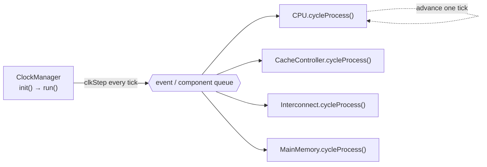
```mermaid
flowchart LR
    CM["ClockManager<br/>init() → run()"] -->|clkStep every tick| Q{{"event / component queue"}}
    Q --> C1["CPU.cycleProcess()"]
    Q --> C2["CacheController.cycleProcess()"]
    Q --> C3["Interconnect.cycleProcess()"]
    Q --> C4["MainMemory.cycleProcess()"]
    C1 -. "advance one tick" .-> C1
```

The `ClockManager` owns the simulation loop. On each `clkStep` it advances every
`ClockedObj` by one tick via `cycleProcess()`. Because all components share one
clock domain, latencies are consistent system‑wide (the [Logger](Logger.md) uses
this to measure every stage in the *originating core's* clock). Components never
call each other synchronously — they communicate only by placing `Message`s into
**interfaces**, which the next component drains on its own tick. That decoupling is
what makes the hierarchy modular and back‑pressured.

---

## 3. Component map

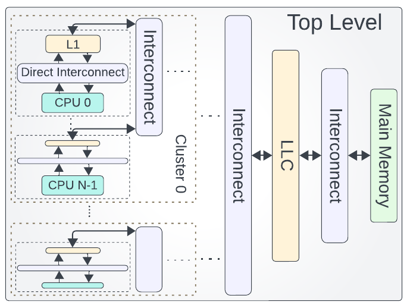

A configurable system is clusters of CPU cores, each with private caches and a
direct interconnect, joined through configurable interconnects to a shared LLC and
main memory. The class hierarchy behind it:

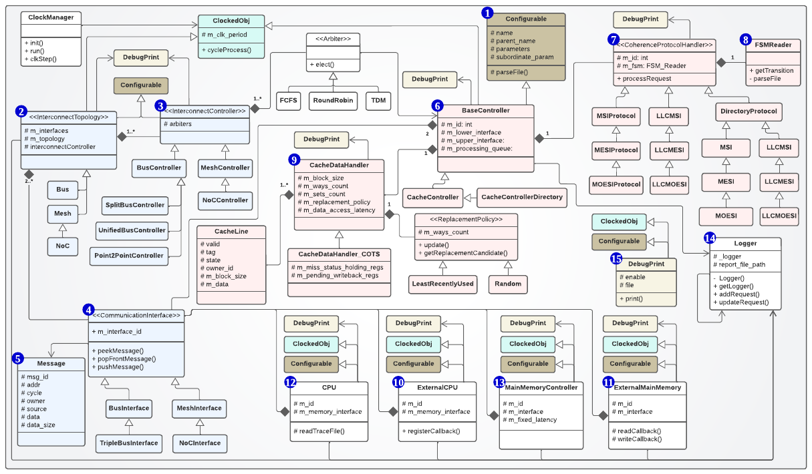

| Role | Class(es) | Notes |
|---|---|---|
| Clock | `ClockManager`, `ClockedObj` | drives `cycleProcess()` each tick |
| Config | `Configurable` | hierarchical CSV + CLI parameters |
| Core | `CPU` (trace), `ExternalCPU` (gem5/MacSim) | issues `Message`s |
| Transport | `CommunicationInterface` | `pushMessage` / `peekMessage` / `popFrontMessage` |
| Message | `Message` | `msg_id, addr, cycle, owner, source, data` |
| Cache | `BaseController` → `CacheController` / `CacheControllerDirectory` | processing queue + handlers |
| Coherence | `CoherenceProtocolHandler` → `MSI/MESI/MOESI` (+ LLC + directory) | driven by `FSMReader` |
| Data | `CacheDataHandler` → `CacheDataHandler_COTS` | arrays, MSHRs, write‑back buffers, replacement |
| Interconnect | `InterconnectTopology` + `InterconnectController` + `Arbiter` | bus / mesh / NoC |
| Memory | `MainMemoryController` (fixed‑latency), `ExternalMainMemory` (MCsim) | endpoint |
| Monitoring | `Logger`, `DebugPrint` | see [Logger.md](Logger.md) / [Debugger.md](Debugger.md) |

---

## 4. Anatomy of a component: the cache controller

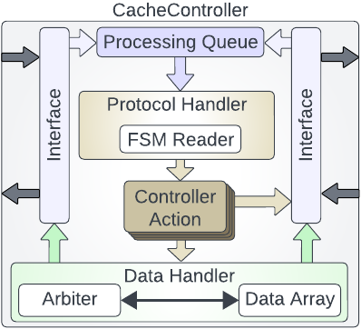

For a concrete instance of everything below, wired up as the four-core system actually
configures it, see the annotated LLC:

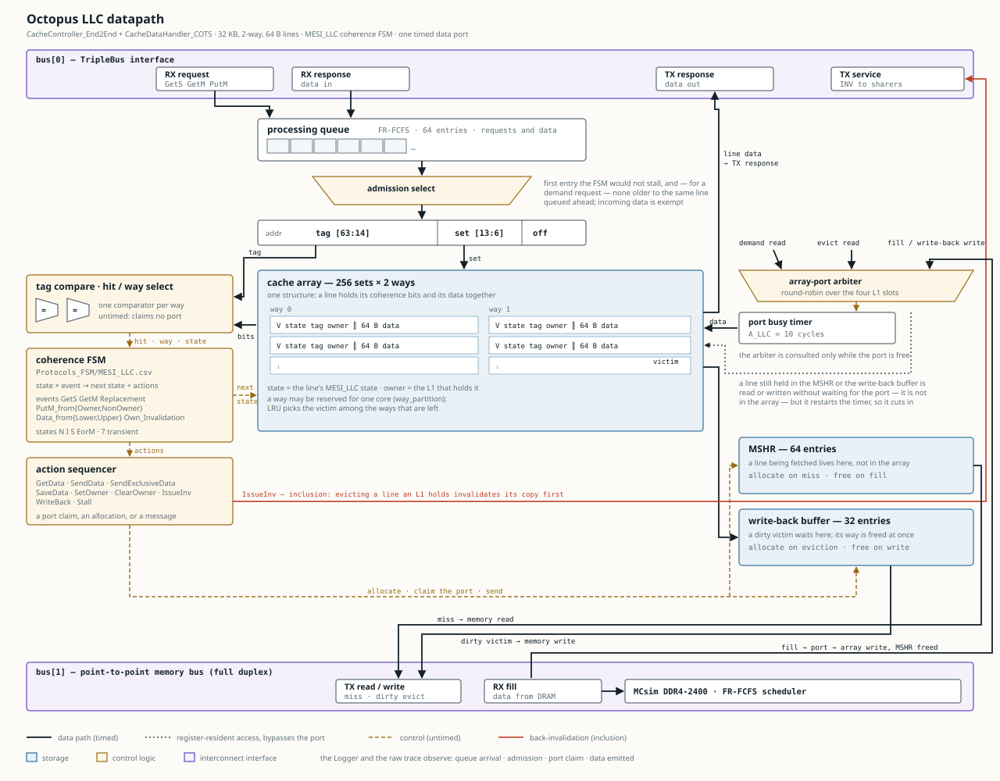

It is a datapath drawing, and it follows the model rather than a textbook cache. The address
splits into tag, set and offset, and the set indexes **one** array: in Octopus a line carries its
coherence bits and its data together, so there is no separate tag array. That array is read two
ways, and the difference matters for every latency the simulator reports. Reading a line's bits
(the tag compare, the state the FSM needs) is **untimed** and claims nothing. Reading or writing
its **data** goes through a single port, which demand reads, eviction reads and fill or
write-back writes contend for through the round-robin arbiter, and which is then busy for
`A_LLC` cycles. A line that currently sits in the MSHR or the write-back buffer is read without
waiting for that port, because it is not in the array yet — the dotted bypass — but it still
restarts the busy timer, which is why such accesses cut in ahead of one already in progress.

Control is the dashed amber layer: the line state and the decoded event enter the coherence FSM,
whose next state is written back into the line and whose actions become port claims, buffer
allocations and messages. A miss allocates in the MSHR and leaves on the memory bus; a dirty
victim moves to the write-back buffer and frees its way at once; and because the cache is
inclusive, the FSM's `IssueInv` on an eviction invalidates the copy in whichever L1 holds the
line — the red path, and the reason a task whose working set fits in its own private cache can
still be disturbed by other cores.

The same drawing with one path highlighted — a read or write **hit**, a `GetS` or `GetM` that
finds the line in a stable state — from the request's arrival on the bus to its data leaving on
the response channel, in ten numbered steps:

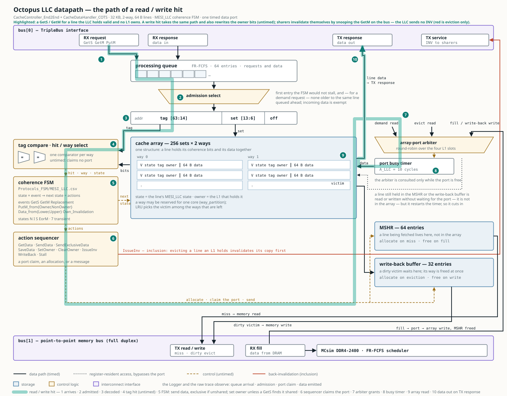

Steps 4–6 — tag compare, FSM, sequencer — take no simulated time. What a hit pays for is the
wait in the processing queue (1–3), the wait for the port (7), and then the `A_LLC`-cycle access
itself (8–9). A write hit differs from a read hit in what the FSM does, not in the path: the
`GetM` gets plain data where a `GetS` gets exclusive data, and the FSM also rewrites the owner
bits (untimed). Nothing else changes — in particular the LLC sends **no** invalidation: on the
snooping bus every sharer sees the `GetM` itself and drops its copy (`S + Other_GetM → I`), so
`IssueInv` is reserved for evictions.

The figure draws the case where the LLC serves the data — the line is valid in the array and no
L1 owns it (`I` or `S` in `MESI_LLC.csv`). The third case, a hit on a line an L1 holds in
`EorM`, does not use the port at all: the owner answers the `GetS` on the bus with `Data2Both`,
and the LLC only saves that copy (`S_d → SaveData → S`); on a `GetM` the owner hands the line
straight to the requester and the LLC merely rewrites the owner bits.

The write hit drawn on its own, so the difference is visible rather than described. The path
is the read hit's; what is new is the branch marked **5b** — the FSM's `SetOwner` written back
into the line's bits over the dashed control wire, untimed — and the plain-data response:

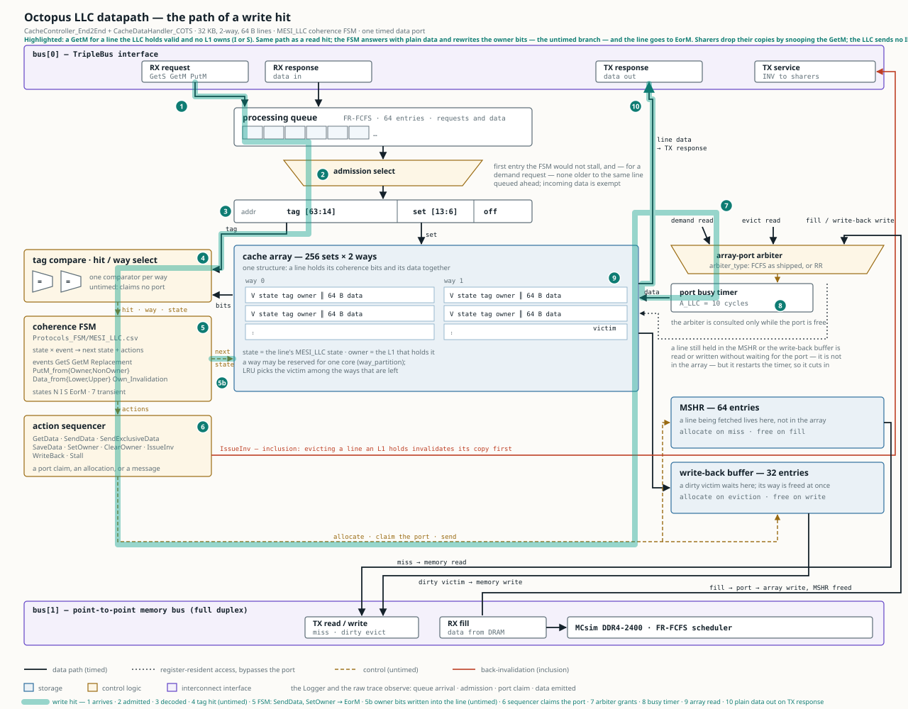

And the same again for a read **miss** in the simplest case — the set still has a free way, so
nothing is evicted:

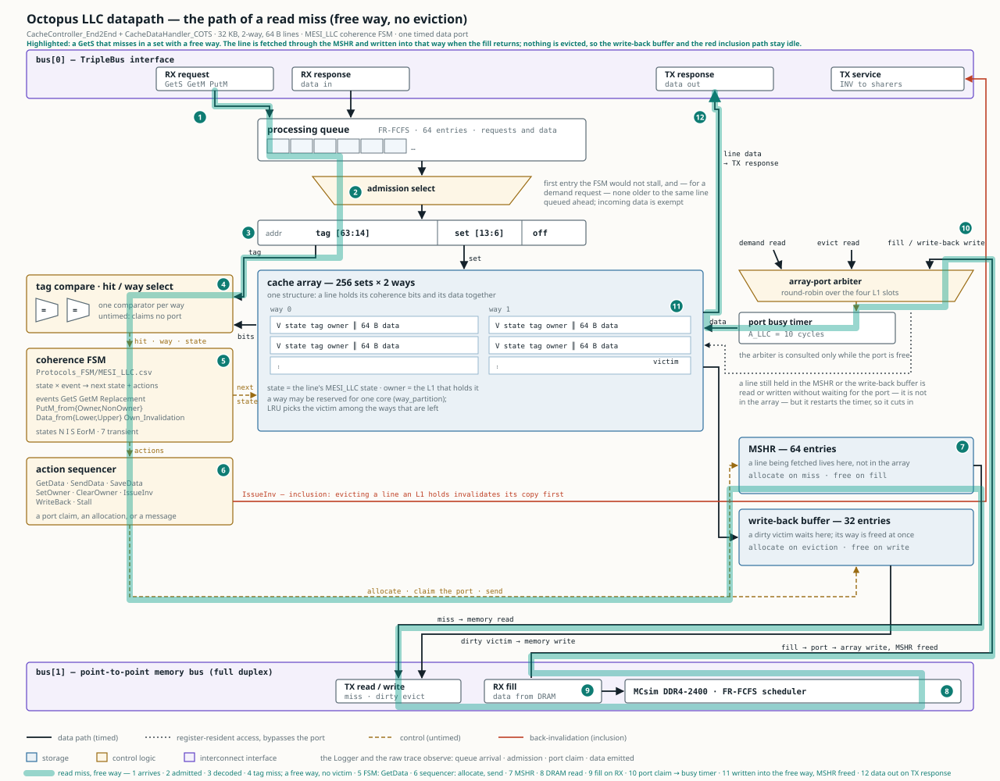

The request takes the same first six steps and then diverges at the tag compare: the FSM's
`GetData` allocates an MSHR entry, the read leaves on `bus[1]`, and the line waits in the MSHR —
not the array — until DRAM answers. The fill then contends for the port like any other array
access, is written into the free way, frees the MSHR, and goes out on TX response. Because no
victim is chosen, the write-back buffer and the red inclusion path are never touched. A miss into
a *full* set adds a second actor, and it deserves its own colour:

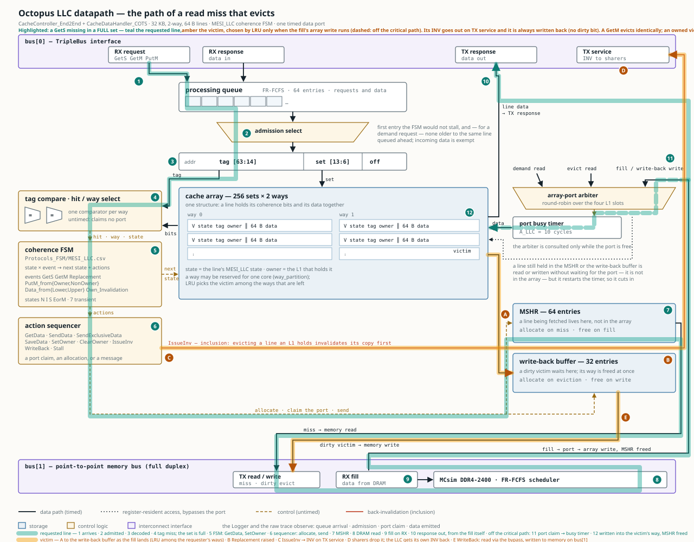

Two things in that drawing are easy to get wrong from a textbook. First, **the victim is chosen
late**: the miss allocates an MSHR and sends the read while the full set is left alone, and only
when the fill's array write runs does the data handler pick the LRU line among the requester's
allowed ways, move it — bits and data — into the write-back buffer, and put the fill in its way
(`moveLine2WB` inside `updateLineData`). The requester's data leaves on TX response right then;
everything the victim costs comes afterwards and lands on *other* traffic. Second, the victim's
exit is a coherence transaction, not a buffer drain: a `Replacement` is raised for it and goes
through the queue and the FSM like any request, `IssueInv` puts an INV on the service channel,
every L1 that shares the line drops it (this is the inclusion interference the demo measures),
the LLC receives its own INV back, and only then does `WriteBack` read the line — from the
buffer, over the dotted bypass — and send it to memory. There is no dirty bit in the model, so
every victim is written back; the code marks the spot with a `ToDo`. A `GetM` miss evicts
identically. A victim an L1 *owns* adds one leg: the owner answers the INV with its data, and
that copy is what reaches memory.

A `CacheController` (a `BaseController`) has **two `CommunicationInterface`s** — one
facing the cores below, one facing the interconnect above. Incoming messages are
serialized into a **processing queue** ordered **First‑Ready First‑Come‑First‑Serve
(FR‑FCFS)**. Each message is handed to the **protocol handler**, which returns a
list of `ControllerAction`s; the controller executes them against the **data
handler** (`CacheDataHandler_COTS`: data array + replacement policy + MSHRs +
write‑back buffer, arbitrated on the data port). The controller is protocol‑
agnostic: it knows *how* to perform actions (send a bus message, update a line,
issue a writeback), not *which* actions a given (state, event) requires — that is
the protocol handler's job.

**Bus‑delivery order at the interface.** A snoop protocol is only correct if every
controller observes bus transactions in the *same* order. `BusInterface` therefore
stamps each RX delivery with one global sequence number, and `TripleBusInterface`
hands out a service‑channel message (an LLC back‑invalidation) only when it was
delivered *before* the request at the head of the request RX. Data responses are
deliberately not ordered against requests (they are exempt so that a full queue of
stalled requests can always drain). Giving the service channel unconditional
priority let a controller that was one message behind process an invalidation
ahead of a `GetM` every other snooper had already seen, which parked the LLC in a
transient state with no exit.

---

## 5. The coherence engine (CSV‑FSM)

Coherence is **data, not code**. A protocol is a finite‑state machine stored as a
CSV table:

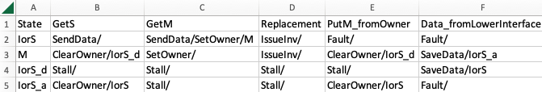

Rows are states (stable **and** transient), columns are coherence events, and each
cell is `action(s)/next-state`. At startup [`FSMReader`](../header/FSMReader.h)
parses the table into a transition map; at run time the protocol handler looks up
`(state, event)` and returns the actions.

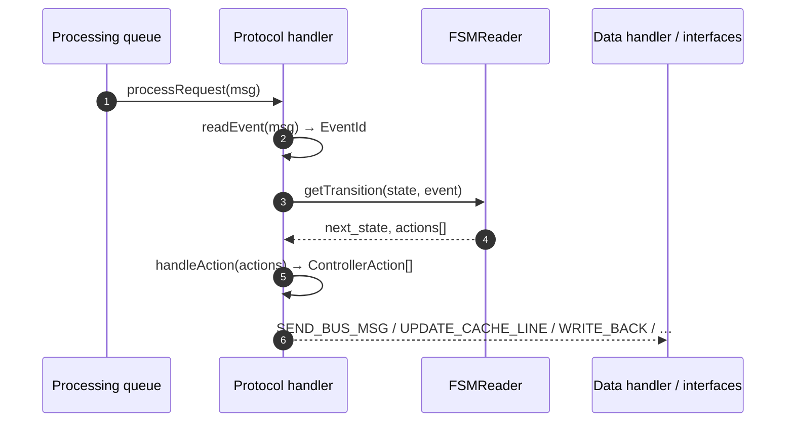
```mermaid
sequenceDiagram
    autonumber
    participant Q as Processing queue
    participant PH as Protocol handler
    participant FSM as FSMReader
    participant DH as Data handler / interfaces
    Q->>PH: processRequest(msg)
    PH->>PH: readEvent(msg) → EventId
    PH->>FSM: getTransition(state, event)
    FSM-->>PH: next_state, actions[]
    PH->>PH: handleAction(actions) → ControllerAction[]
    PH-->>DH: SEND_BUS_MSG / UPDATE_CACHE_LINE / WRITE_BACK / …
```

`readEvent` maps a message to the correct FSM column from its **source and
contents** (e.g. a demand `Load`/`Store` from below, an `Own/Other_GetS/GetM` snoop
from the bus, `OwnData` when `data != NULL`). A cell of `Fault/` means "this
(state, event) should be unreachable" — Octopus **halts and reports it** rather than
silently mis‑routing, which is what makes the protocol *auditable* (see the
verification workflow in [Logger.md](Logger.md)/the paper). Adding or modifying a
protocol is a spreadsheet edit — no C++ change, no recompilation.

> **Row order matters:** `FSMReader` indexes transition rows by **position**, so a
> new state's row must be appended so its line number matches its state id.

---

## 6. A request's journey (end to end)

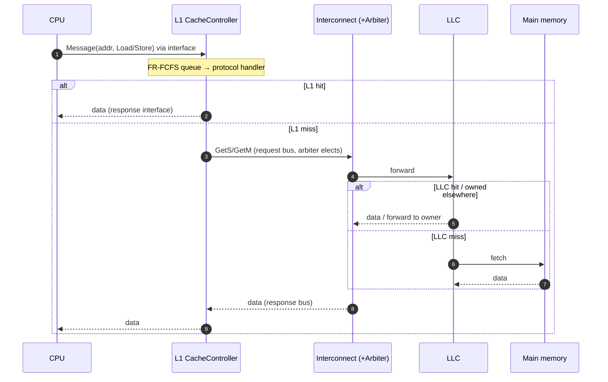
```mermaid
sequenceDiagram
    autonumber
    participant CPU
    participant L1 as L1 CacheController
    participant IC as Interconnect (+Arbiter)
    participant LLC
    participant MEM as Main memory
    CPU->>L1: Message(addr, Load/Store) via interface
    Note over L1: FR-FCFS queue → protocol handler
    alt L1 hit
        L1-->>CPU: data (response interface)
    else L1 miss
        L1->>IC: GetS/GetM (request bus, arbiter elects)
        IC->>LLC: forward
        alt LLC hit / owned elsewhere
            LLC-->>IC: data / forward to owner
        else LLC miss
            LLC->>MEM: fetch
            MEM-->>LLC: data
        end
        IC-->>L1: data (response bus)
        L1-->>CPU: data
    end
```

At each hop the component stamps a Logger checkpoint, so the same journey is what
the [Logger](Logger.md) decomposes into per‑stage latencies.

---

## 7. Interconnect

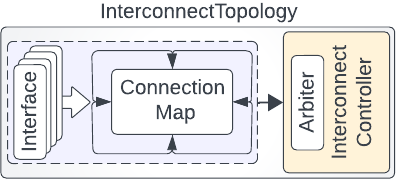

An interconnect is an `InterconnectTopology` — a set of message‑holding
**interfaces** plus a **connection map** describing who talks to whom — and an
`InterconnectController` whose **`Arbiter`** (`elect()`) resolves contention on
shared links. Swapping the topology/controller pair yields **point‑to‑point,
unified bus, split bus, triple bus, mesh, or NoC**; swapping the arbiter yields
**FCFS, FR‑FCFS, RR, Weighted/Harmonic‑RR, TDM, or GRROF**. Nothing else in the
system changes.

---

## 8. Configuration system

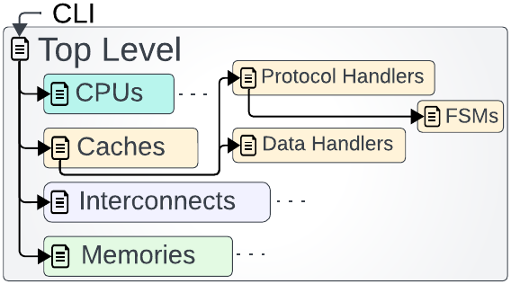

Every component is a `Configurable`: it reads default parameters from its own CSV,
and a parent may override a child's defaults. Configuration propagates from the CLI
through the top‑level module down to each sub‑component and FSM, so a value can be
**inherited, overridden, or extended** at any level. Two consequences:

- A designer sweeps the **entire design space from the CLI**, without editing the
  top config for each experiment — the basis of the reproducible sweeps in
  [`REPRODUCIBILITY.md`](../REPRODUCIBILITY.md).
- Defaults let a user focus only on the parameters they care about.

---

## 9. Integration modes

| Mode | Core | Memory | Use |
|---|---|---|---|
| **Standalone** | `CPU` (reads a trace file) | `MainMemoryController` (fixed latency) | fast design‑space exploration |
| **Full‑system** | `ExternalCPU` (gem5 Arm/Linux, MacSim) via `registerCallback` | `ExternalMainMemory` (MCsim DDR) via read/write callbacks | high‑fidelity, real applications |

Because the endpoints are just `CommunicationInterface` producers/consumers, the
**same CSV‑configured hierarchy** runs unchanged in both modes — only the request
source and the memory sink are swapped. Arm ISA specifics (LL/SC, LSE atomics,
Linux boot) live in the gem5↔Octopus bridge.

---

## 10. Extending Octopus

| To add… | Do this | Recompile? |
|---|---|---|
| a **coherence protocol / variant** | write/edit a CSV FSM (L1 + LLC tables) | **no** |
| an **arbiter** | subclass `Arbiter`, implement `elect()`, register it | yes |
| a **replacement policy** | subclass `ReplacementPolicy` (`update`, `getReplacementCandidate`) | yes |
| an **interconnect topology** | subclass `InterconnectTopology` / `…Controller` | yes |
| a **memory model** | implement the `ExternalMainMemory` callback interface | yes |

The split of coherence into a **handler + CSV FSM** is why MESI and MOESI extend
MSI at a fraction of the code of monolithic simulators (see the LOC comparison in
[`PUBLICATIONS.md`](../PUBLICATIONS.md) and the paper).

---

## 11. Monitoring

Two complementary facilities observe the running system:

- **[Logger](Logger.md)** — automatic, global, fixed‑format: per‑request per‑stage
  latency, worst‑case tracking, and the `Summary.csv` that drives sweeps.
- **[Debugger](Debugger.md)** — opt‑in, per‑component, filterable, free‑format:
  trace a specific address or coherence event.

Together they make Octopus **observable** (where did the time go?) and
**verifiable** (what exactly did the protocol do?), the properties that make it
suited to real‑time and safety‑critical memory‑system research.
