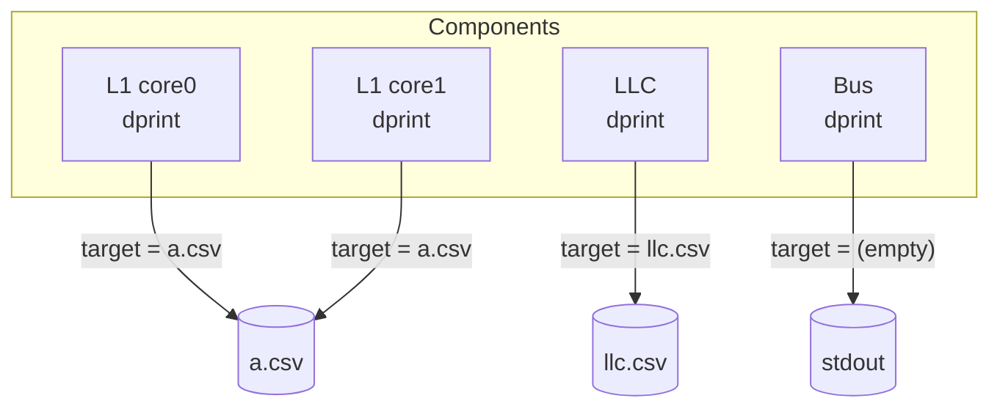
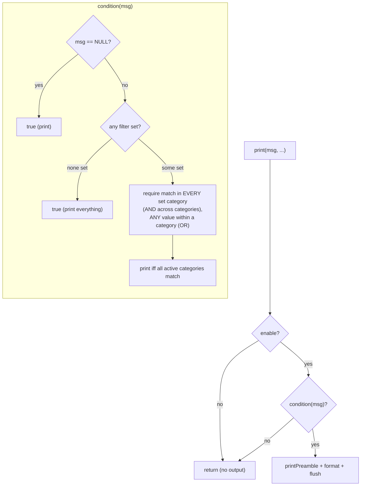
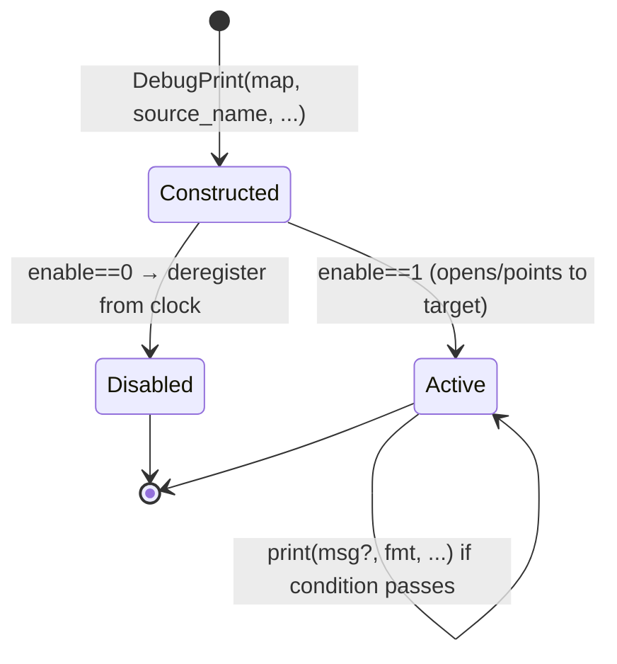

# Octopus Monitoring — The Debugger (`DebugPrint`)

> Source: [`header/DebugPrint.h`](../header/DebugPrint.h), [`src/DebugPrint.cpp`](../src/DebugPrint.cpp)

The **Debugger** (`DebugPrint`) is the second of Octopus's monitoring facilities
(the other is the [Logger](Logger.md)). Where the Logger is a global, automatic,
fixed‑format **latency** recorder, the Debugger is an **opt‑in, per‑component,
filterable, free‑format** trace facility. It answers *"what exactly happened to
this message, or at this component?"* — the tool you reach for to trace a
coherence bug, watch one address, or log a rare event.

It generates **custom CSV reports** that can be **specific to one component** or
**aggregated across selected components**, and its output can be either
**general event prints** or **message‑associated prints** with **filters** that
regulate how often something is printed.

---

## 1. Design at a glance



**Each component owns its own `DebugPrint` instance.** For example every cache
controller builds one in `BaseController`:

```cpp
dprint = new DebugPrint(getSubMap("dprint"), name + std::to_string(m_id), parent_name + "." + name);
```

The `source_name` (e.g. `CacheController2`) tags every line that instance emits.
Multiple instances that share the same `target` filename **interleave into one
file** (aggregated view); distinct targets give **per‑component files**; an empty
target prints to **stdout**.

---

## 2. The two print modes

A component calls the single public method:

```cpp
void print(Message *msg = NULL, const char *format = "", ...);   // printf-style
```

1. **General event print** — `msg == NULL`. Fires on *any* event, unattached to a
   message. The preamble columns that need a message are left blank.
   *Example:* print the cycle and cache id whenever a queue fills.
   ```cpp
   dprint->print(NULL, "processing queue FULL");
   ```

2. **Message‑associated print** — `msg != NULL`. Emits a per‑message **preamble**
   (identity columns) plus your custom text, **subject to the filters** (§4).
   *Example:* report the id of every message reaching the LLC that targets a
   given block.
   ```cpp
   dprint->print(&msg, "state(%d) -> next(%d) ev(%d)", st, next, ev);
   ```

---

## 3. The preamble (configurable CSV columns)

When `print_preamble` is set, each line is prefixed with a configurable set of
identity columns (and `init()` writes a matching CSV header). Toggles:

| Config toggle | Column | Value |
|---------------|--------|-------|
| `print_name` | `Name` | the component's `source_name` |
| `print_clk` | `Clock` | the debugger's cycle counter |
| `print_msg_id` | `Msg_id` | `msg->msg_id` |
| `print_addr` | `Addr` | `msg->addr` |
| `print_from` | `From` | `msg->from` (source component) |
| `print_to` | `to` | `msg->to` as a list `[id-id-id]` (multi‑destination) |
| `print_owner` | `Owner` | `msg->owner` |

The custom `format` text is appended after the preamble, then `,\n` and a flush.
For a general (`msg == NULL`) print, the message‑dependent columns are emitted
empty so the CSV stays column‑aligned.

---

## 4. The filter system — `condition()`

This is what "regulates printing frequency." Four filter categories, each a
configurable list; each entry is matched against the message:

| Config | Matches on | Extra |
|--------|-----------|-------|
| `cond_addr` | `(msg->addr & addr_filter) == entry` | `addr_filter` is a **hex mask**, so you can filter by **block** (mask off offset bits) rather than exact word |
| `cond_msg_id` | `msg->msg_id == entry` | |
| `cond_from` | `msg->from == entry` | |
| `cond_owner` | `msg->owner == entry` | |

### The matching logic



Concretely, `condition` returns:

```
cond[0]  |  (cond_addr_ok & cond_msgid_ok & cond_from_ok & cond_owner_ok)
```

- If **no** filter is configured, `cond[0]` stays `true` → **print everything**.
- If **any** filter is set, `cond[0]` becomes `false`, and the message must
  satisfy **every active category** (logical **AND** across categories); within a
  category, **any** listed value is a match (logical **OR**).

**Examples**
- Watch one block across the whole run: `addr_filter = FFFFFFC0` (64‑B block
  mask), `cond_addr = <block base>`.
- Narrow to one core's traffic to that block: also set `cond_from = 2`.
- Follow a single transaction: `cond_msg_id = 1234`.

---

## 5. Output aggregation (individual vs combined reports)

A **static** map keys open files by name:

```cpp
static map<string, FILE*> unique_file;   // target filename -> shared handle
```

- Point several components at the **same `target`** → their lines interleave into
  **one aggregated report** ("aggregated among selected components").
- Give each a **distinct `target`** → **component‑specific reports**.
- Leave `target` **empty** → write to **stdout**.

Because the handle is shared, timestamps (`Clock`) and `Name` columns let you
disentangle interleaved lines from different components in an aggregated file.

---

## 6. Configuration reference

Debugger settings are nested under a component's `dprint.` prefix in the system
CSV (shown here for a cache controller):

```
cache_controller[*].dprint.enable(i),0                      # 0 = off (zero overhead), 1 = on
cache_controller[*].dprint.target(s),BMs/testDPrint/dprint.csv   # empty = stdout
cache_controller[*].dprint.print_preamble(i),1
cache_controller[*].dprint.print_name(i),1
cache_controller[*].dprint.print_clk(i),1
cache_controller[*].dprint.print_msg_id(i),1
cache_controller[*].dprint.print_addr(i),1
cache_controller[*].dprint.print_from(i),1
cache_controller[*].dprint.print_to(i),1
cache_controller[*].dprint.print_owner(i),1
cache_controller[*].dprint.addr_filter(s),FFFFFFC0          # hex mask
cache_controller[*].dprint.cond_addr(vs),                   # list of block bases
cache_controller[*].dprint.cond_msg_id(vi),
cache_controller[*].dprint.cond_from(vi),
cache_controller[*].dprint.cond_owner(vi),
```

(`i` = int, `s` = string, `vi`/`vs` = vector of int/string, per Octopus's typed
config keys.) Because these are ordinary config fields, **enabling and scoping a
trace requires no recompilation** — the same property that makes protocols and
topologies swappable applies to observability.

---

## 7. Performance — zero cost when off

A `DebugPrint` with `enable == 0` **removes itself from the clock loop** in its
constructor:

```cpp
if(!enable)
    ClockManager::getClockManager()->deregisterCLKObj(this);
```

The rationale (from the code comment): a disabled debugger's only per‑cycle work
is bumping a counter that is read solely while printing, yet dozens of idle
`DebugPrint` objects were measured to dominate event dispatch (~57% of all
`cycleProcess` calls). Deregistering them makes observability **free when
disabled**, so instances can be left in place throughout the codebase.

---

## 8. Lifecycle & API



| Member | Role |
|--------|------|
| `DebugPrint(map, source_name, …)` | construct from config; open/share `target`; deregister if disabled |
| `print(msg, fmt, …)` | the public entry point (general or message‑associated) |
| `condition(msg)` | filter test (§4) |
| `printPreamble(msg)` | emit the configured identity columns |
| `init()` | write the CSV header row (when preamble is on) |

---

## 9. Relationship to the Logger

| | [Logger](Logger.md) | Debugger (`DebugPrint`) |
|---|---------------------|-------------------------|
| Scope | global, automatic | per‑component, opt‑in |
| Granularity | every message, full stage breakdown | filtered messages / arbitrary events |
| Output | fixed `LatencyReport` + `Summary.csv` | custom CSV (your format), per‑component or aggregated |
| Purpose | **metrics / WCET / runtime** | **debugging / tracing** |
| Cost when unused | always on | **zero** (deregistered) |

Reach for the **Logger** to measure latency and worst‑case bounds; reach for the
**Debugger** to see exactly what happens to a chosen message, address, or
component.
