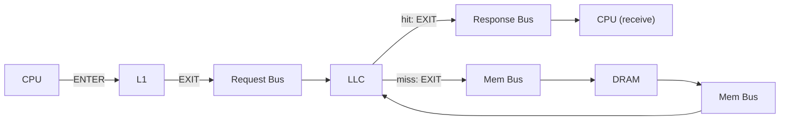
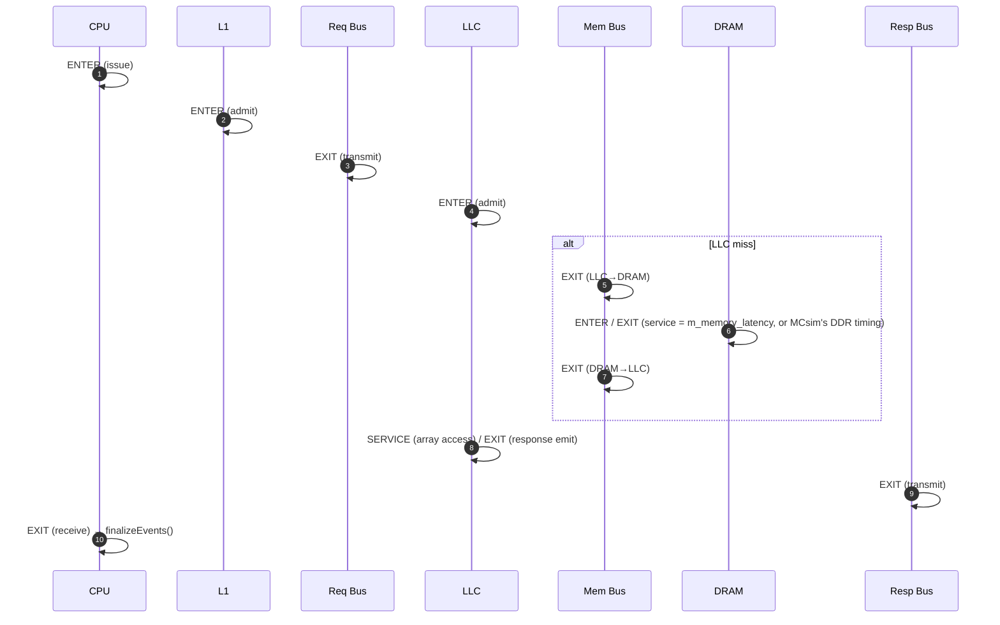

# Octopus Monitoring — The Logger (Latency Logging)

> Source: [`header/Logger.h`](../header/Logger.h), [`src/Logger.cpp`](../src/Logger.cpp)

The **Logger** is one of Octopus's two monitoring facilities (the other is the
[Debugger](Debugger.md)). It performs **latency logging**: it silently tracks *every* request as it
traverses the simulated memory hierarchy and, when the request completes, decomposes its end‑to‑end
latency into the individual stages it passed through. At end of simulation it emits, per CPU, a
detailed per‑request report plus worst‑case and average statistics, and a single cross‑core
`Summary.csv`.

It answers two questions at once:
- **Performance:** what is the average memory latency / total execution time?
- **Real‑time / predictability:** what is the **worst‑case** latency at each individual stage
  (bus, LLC, DRAM, …)?

The Logger is **passive**: it only reads clocks and records events, so it never changes any timing.

---

## 1. Design at a glance — self‑describing events

Each in‑flight request (keyed by `msg_id`) owns a **time‑ordered list of events**. Every event is
**self‑describing** — it records *which component* stamped it and *which phase* — so the per‑stage
decomposition is a **generic walk** over the list, never an inference from a checkpoint's position
or a vector's size.

```cpp
enum class Role  : uint8_t { CPU, L1, REQ_BUS, RESP_BUS, LLC, MEM_BUS, DRAM };
enum class Phase : uint8_t { ENTER, SERVICE, EXIT };
struct LogEvent  { uint32_t comp_id; Role role; Phase phase; uint64_t cycle; };
```

- **ENTER** — the component takes custody of the request (admitted to its queue / RX buffer).
- **SERVICE** — the component begins the actual work (e.g. the LLC data‑array access is granted).
- **EXIT** — the component hands the request to the next one (pushed to the next TX buffer /
  transmitted / delivered).

A request's timeline is a chain of these events; consecutive events bound the stages, and the stages
**tile exactly** to the total (`Σ stages == Total`) by construction.

> **Why events, not a fixed checkpoint array?** The previous design multiplexed several
> resources/phases into two shared vectors (`CACHE_CHECKPOINT`, `RESP_BUS_CHECKPOINT`) and recovered
> "which is which" by index/count. That inference broke whenever stamping was conditional (an LLC
> data‑access was stamped only under contention) or an extra event appeared (a post‑response L1
> fill), silently mislabelling stages — e.g. an LLC hit's *Response‑Bus* absorbing its *L2‑Stall*.
> Self‑describing events remove that ambiguity: each stamp names its own component and phase.



---

## 2. The clock‑domain trick

Every cycle, `CPU::cycleProcess` calls `Logger::setClkCount(core_id, m_clk_cycle)`, so
`core_clk_count[core_id]` always holds *that core's* current cycle. `addRequest` binds a `msg_id` to
its originating core; every later `event()` records `core_clk_count[originating core]`. The result:
**all stages of a request are measured in its originating core's clock**, no matter which component
(bus, LLC, DRAM) stamps the event. No per‑component clock bookkeeping is needed.

---

## 3. Where each event is stamped

| Event | Stamped by |
|-------|-----------|
| `CPU` / `ENTER` | `CPU::addRequest` (request issued) — plus `addRequest` binds the core + identity |
| `L1` / `ENTER` | `BaseController::processLogic` when an L1 admits a lower‑interface request |
| `REQ_BUS` / `EXIT` | `BusController::broadcast` on the L1↔LLC bus (request transmitted) |
| `LLC` / `ENTER` | `BaseController::processLogic` when the LLC admits a bus request |
| `MEM_BUS` / `EXIT` | `BusController` on the LLC↔DRAM bus (crossing, each direction) |
| `DRAM` / `ENTER`,`EXIT` | `MainMemoryController` (request arrives / data leaves after `m_memory_latency`) or `MCsimInterface` (request accepted by MCsim / read data returned by its callback) |
| `LLC` / `SERVICE`,`EXIT` | `BaseController::hitAction` / `removePendingAndRespond` (array access granted; response emitted) |
| `L1` / `SERVICE`,`EXIT` **before** `RESP_BUS.EXIT` | `BaseController::performWriteBack` when an L1 **owner supplies another core's request** (cache‑to‑cache transfer); fan‑out copies are stamped in `CacheController::performWriteBack`. The responder is then that L1, not the LLC (see §5) |
| `RESP_BUS` / `EXIT` | `BusController::send` on the L1↔LLC bus (response transmitted) |
| `CPU` / `EXIT` | `CPU::checkReceiveBuffer` (response delivered) → triggers `finalizeEvents` |

A controller stamps its **own** role: L1 controllers stamp `L1`, the LLC (tagged with
`setLogRole(Role::LLC)` in `MultiCoreSystem`) stamps `LLC`. The LLC↔DRAM bus is tagged
`setMemBus()`, so its crossings log as `MEM_BUS` rather than `REQ_BUS`/`RESP_BUS`. Untracked traffic
(writebacks, invalidations, replacement messages) never had an `addRequest`, so `event()` skips it.

The key stamp is **`LLC` / `EXIT`** (the response‑emit point): it makes
`Response‑Bus = RESP_BUS_grant − LLC_emit` unambiguous for every request class. A post‑completion L1
fill is a separate event *after* the terminal CPU event, so it can never contaminate a forward stage.

---

## 4. A request's journey



---

## 5. Latency decomposition (`finalizeEvents`)

When the CPU stamps its `EXIT`, `finalizeEvents` finds the milestones in the timeline and writes one
report row. Each stage is a difference of **named** milestones — no positional inference:

| Column | Definition |
|--------|-----------|
| **CPU** | `CPU.ENTER − READY_CYCLE`. `READY_CYCLE` (column 3) is the sim cycle at which the request could first issue (compute gap elapsed, sample loaded), so `Ready + CPU = issue cycle` on every row — the rows are time‑resolvable (the raw trace timestamp is not reported: the trace‑driven `CPU` only uses *gaps* between timestamps, so it is unrelated to sim time). With the trace‑driven `CPU` the compute gap restarts at the **last received** response, so a full OoO window shows up as a later `Ready`, not as a wait, and this column is 0 by construction; it is kept for CPU models that can stall a ready request |
| **L1‑Stall** | `L1.ENTER − CPU.ENTER` |
| **Request‑Bus** | `REQ_BUS.EXIT − L1.ENTER` |
| **L2‑Stall** | `LLC.ENTER − REQ_BUS.EXIT` (queue at the LLC before admission) |
| **L2‑Access** | hit: `LLC.SERVICE − LLC.ENTER` (data‑array wait); miss: `LLC.SERVICE − MEM_BUS.EXIT₂` (refill) |
| **Response‑Bus** | `RESP_BUS.EXIT − LLC.EXIT` — **the clean response‑bus leg** |
| **L2‑DRAM‑Bus** | miss: `(DRAM.ENTER − LLC.ENTER) + (MEM_BUS.EXIT₂ − DRAM.EXIT)` (LLC handoff + mem‑bus transfers) |
| **DRAM** | miss: `DRAM.EXIT − DRAM.ENTER` (pure DRAM service) |
| **L1‑Access** | `CPU.EXIT − max(L1.ENTER, RESP_BUS.EXIT)` — the return path: an L1 hit's own service, or (bus‑served) transfer after the grant + L1 fill + hand‑off to the CPU. Variable under OoO (the L1 may be busy when the response lands) |
| **Total** | `CPU.EXIT − CPU.ENTER` (true end‑to‑end) **= Σ of the seven stage columns** (L1‑Stall … L1‑Access; CPU is issue‑vs‑trace, outside Total) |
| **Effective** | `CPU.EXIT − max(prev_request_finish, CPU.ENTER)` (see §6) |
| **Oldest** | head‑of‑queue latency, PCC's per‑request quantity: `CPU.EXIT − T_o`, where `T_o` is the cycle this request became the **oldest outstanding request of its core** — its issue cycle if nothing older was in flight, else the retire cycle of the previous oldest. A request that retires while an older one is still in flight was never oldest and reports **0** (a real value is ≥ 1). At `OoO = 1` it equals Total; under OoO it is what Lemma‑9‑style bounds actually bound. Differs from Effective, which anchors on the last completion of *any* request (completion order), not on older‑issued ones |
| **LLC Arrival State** | MESI_LLC state id of the line when the request arrived at the LLC (−2 = never reached the LLC, i.e. an L1 hit; −1 = line absent). Stable (I=3, S=4, EorM=5) ⇒ admitted at once; transient (IorS_a=6, MN_d=7, S_d=8, I_d=9, N_a=10) ⇒ waits a coherence round trip; NE_d=1 / NM_d=2 ⇒ a DRAM fetch for the line is already in flight — a **coalesced** hit if its own row has DRAM = 0 |
| **LLC Gate** | 1 if an older demand request to the same line was already queued at the LLC when this one arrived (per‑line FCFS gate) |
| **Resp Ahead** | younger own‑core, bus‑served responses granted on the response bus between this request's emit and its grant — the own‑slot queue it found in front of it (own‑window / overtaking term) |
| **Resp Ahead Refills** | how many of those were DRAM misses (refills that returned faster than this request's LLC path) |
| **Array Ahead** | accesses served at the LLC array port between this request's park and its grant (0 if it never had to park) |
| **Array Ahead Writes** | how many of those were data writes (L1 write‑backs / snooped supplies / fills written into the array) |
| **LLC Stall State** | the line's state at the **first** cycle the LLC FSM judged this request NonReady (S_d/I_d/MN_d/IorS_a/N_a, or NE_d/NM_d for a DRAM fetch in flight); −2 = never stalled by the FSM, so `L2‑Stall > 1` with −2 means the wait came from the per‑line FCFS gate (an older request to the same line ahead) — the precise attribution of a stall, as opposed to the state at *arrival* |

Milestones that a request never reaches (e.g. the DRAM group for a hit) are absent and their columns
are 0. `finalizeEvents` also asserts `Σ forward‑stages == Total`; under `OCTOPUS_EVENT_DEBUG` any
violation is dumped to stderr, and the running `ok/fail/noresp` tally is printed at end of run.

**Responder substitution.** When the LLC never emits (`LLC.SERVICE/EXIT` absent) because the line's
owner L1 answered the request directly, the last `L1.SERVICE`/`L1.EXIT` **strictly before**
`RESP_BUS.EXIT` are used as the responder milestones, and the responder's `SERVICE` replaces
`LLC.ENTER` as the admission anchor (the owner snoops the request off the bus and may answer before
the LLC even admits it, so the LLC's admission is not on the data path). Then `L2‑Stall` = wait for
the responder after the request‑bus grant, `L2‑Access` = the responder's service time, and
`Response‑Bus` stays `RESP_BUS.EXIT − responder.EXIT`. (The requester's own L1 stamps only ever
follow the grant, so they cannot be picked.) If no responder stamp exists at
all, the whole `LLC.ENTER → RESP_BUS.EXIT` interval is folded into `L2‑Access` (`Response‑Bus = 0`)
so the columns keep tiling, and the request is counted in `noresp`.

`OCTOPUS_EVENT_DUMP=<N>` prints the raw timeline of the first *N* requests with `Total > 100` or a
memory‑bus crossing — the quickest way to see which component stamped what.
`OCTOPUS_EVENT_DUMP_MIN=<cycles>` raises that threshold (e.g. `=3000` to isolate one outlier row
seen in a report).

---

## 6. Effective latency (memory‑level‑parallelism aware)

**Total** double‑counts when requests overlap (out‑of‑order / multiple outstanding). **Effective**
credits only the portion that does *not* overlap the previous request's completion:

```
effective = CPU.EXIT − max(last_finish[core], CPU.ENTER);   last_finish[core] = CPU.EXIT
```

Summing Effective (not Total) recovers the true added execution time. The per‑core **Average
Latency** is the mean of Effective; `max_effective_latency` its worst case.

---

## 7. Reports produced

### Per‑core `LatencyReport_C{id}.csv`
Header + one row per completed request + two footer rows (per‑column worst‑case, then averages):

```
RequstID,Request Address,Ready Cycle,CPU Latency,L1 Stall Latency,Requst Bus Latency,
L2 Stall Latency,L2 Access Latency,Response Bus Latency,L2-DRAM Bus Latency,DRAM latency,
L1 Access Latency,Total Latency,Effective Latency,Oldest Latency,
LLC Arrival State,LLC Gate,Resp Ahead,Resp Ahead Refills,Array Ahead,Array Ahead Writes,LLC Stall State
```
(1‑indexed: 12 = L1 Access, 13 = Total, 14 = Effective, 15 = Oldest, 16–22 = the mechanism trackers — the indices the run/sweep scripts and `sweeps/analyze_mechanisms.sh` use.)

### Cross‑core `Summary.csv`
One row per core: every worst‑case stage + average + **Finish Cycle** (its last request's completion
= its total execution time) + **Worst‑case Oldest Latency** (appended last so earlier column indices are stable). This is the machine‑readable hook for configuration sweeps — it exposes,
per config, the WCET of each stage (showing *where* a knob acts) and the runtime.

---

## 8. Lifecycle & API

| Method | Role |
|--------|------|
| `getLogger()` | singleton accessor |
| `registerReportPath(path)` | where the CSVs are written (`<workload>/newLogger/`) |
| `setClkCount(core, clk)` | called every cycle; establishes the core clock |
| `addRequest(cpu_id, msg)` | begin tracking a request; bind core + identity |
| `event(msg_id, role, comp_id, phase)` | append a self‑describing event |
| `finalizeEvents(msg_id)` | (internal) triggered by the CPU `EXIT`; writes the row, frees the entry |
| `traceEnd(core_id)` | emit the core's footer + its `Summary.csv` row |

- **Memory‑lean:** a request's event list is freed the instant it completes, so only *in‑flight*
  requests consume memory.
- **`OCTOPUS_NO_LOG=1`:** skips per‑request logging but still registers cores and emits `Summary.csv`
  completion — for correctness sweeps where only successful termination matters.
- **`OCTOPUS_EVENT_DEBUG=1`:** prints any tiling violation + the end‑of‑run `ok/fail` tally.

---

## 9. Extending to new topologies

Because every event names its own `Role`, adding a level or an interconnect is a matter of stamping
its `ENTER`/`SERVICE`/`EXIT` events — the decomposition needs no positional bookkeeping. New roles
(e.g. an `L3`) slot into the milestone walk without disturbing existing stages.

---

## 10. Relationship to the Debugger

The Logger is **automatic, global, fixed‑format** — *"how long, and worst case?"* for every request.
The [Debugger](Debugger.md) is **opt‑in, per‑component, filterable, free‑format** — *"what exactly
happened to this request / at this component?"* Use the Logger for metrics and WCET; the Debugger to
trace a specific address or coherence event.
