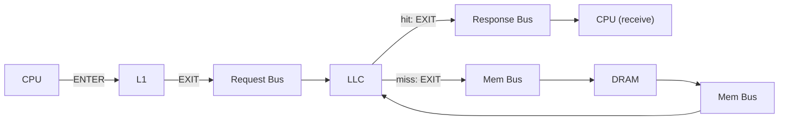
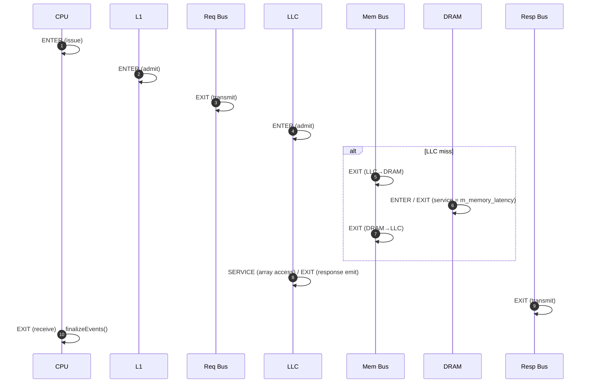

# Octopus Monitoring — The Logger (Latency Logging)

> Source: [`header/Logger.h`](../header/Logger.h), [`src/Logger.cpp`](../src/Logger.cpp)

The **Logger** is one of Octopus's two monitoring facilities (the other is the
[Debugger](Debugger.md)). It performs **latency logging**: it silently tracks *every* request as it
traverses the simulated memory hierarchy and, when the request completes, decomposes its end‑to‑end
latency into the individual stages it passed through. At end of simulation it emits, per CPU, a
detailed per‑request report plus worst‑case and average statistics, and a single cross‑core
`Summary.csv`.

It answers two questions at once:
- **Performance:** what is the average memory latency / total execution time?
- **Real‑time / predictability:** what is the **worst‑case** latency at each individual stage
  (bus, LLC, DRAM, …)?

The Logger is **passive**: it only reads clocks and records events, so it never changes any timing.

---

## 1. Design at a glance — self‑describing events

Each in‑flight request (keyed by `msg_id`) owns a **time‑ordered list of events**. Every event is
**self‑describing** — it records *which component* stamped it and *which phase* — so the per‑stage
decomposition is a **generic walk** over the list, never an inference from a checkpoint's position
or a vector's size.

```cpp
enum class Role  : uint8_t { CPU, L1, REQ_BUS, RESP_BUS, LLC, MEM_BUS, DRAM };
enum class Phase : uint8_t { ENTER, SERVICE, EXIT };
struct LogEvent  { uint32_t comp_id; Role role; Phase phase; uint64_t cycle; };
```

- **ENTER** — the component takes custody of the request (admitted to its queue / RX buffer).
- **SERVICE** — the component begins the actual work (e.g. the LLC data‑array access is granted).
- **EXIT** — the component hands the request to the next one (pushed to the next TX buffer /
  transmitted / delivered).

A request's timeline is a chain of these events; consecutive events bound the stages, and the stages
**tile exactly** to the total (`Σ stages == Total`) by construction.

> **Why events, not a fixed checkpoint array?** The previous design multiplexed several
> resources/phases into two shared vectors (`CACHE_CHECKPOINT`, `RESP_BUS_CHECKPOINT`) and recovered
> "which is which" by index/count. That inference broke whenever stamping was conditional (an LLC
> data‑access was stamped only under contention) or an extra event appeared (a post‑response L1
> fill), silently mislabelling stages — e.g. an LLC hit's *Response‑Bus* absorbing its *L2‑Stall*.
> Self‑describing events remove that ambiguity: each stamp names its own component and phase.



---

## 2. The clock‑domain trick

Every cycle, `CPU::cycleProcess` calls `Logger::setClkCount(core_id, m_clk_cycle)`, so
`core_clk_count[core_id]` always holds *that core's* current cycle. `addRequest` binds a `msg_id` to
its originating core; every later `event()` records `core_clk_count[originating core]`. The result:
**all stages of a request are measured in its originating core's clock**, no matter which component
(bus, LLC, DRAM) stamps the event. No per‑component clock bookkeeping is needed.

---

## 3. Where each event is stamped

| Event | Stamped by |
|-------|-----------|
| `CPU` / `ENTER` | `CPU::addRequest` (request issued) — plus `addRequest` binds the core + identity |
| `L1` / `ENTER` | `BaseController::processLogic` when an L1 admits a lower‑interface request |
| `REQ_BUS` / `EXIT` | `BusController::broadcast` on the L1↔LLC bus (request transmitted) |
| `LLC` / `ENTER` | `BaseController::processLogic` when the LLC admits a bus request |
| `MEM_BUS` / `EXIT` | `BusController` on the LLC↔DRAM bus (crossing, each direction) |
| `DRAM` / `ENTER`,`EXIT` | `MainMemoryController` (request arrives / data leaves after `m_memory_latency`) |
| `LLC` / `SERVICE`,`EXIT` | `BaseController::hitAction` / `removePendingAndRespond` (array access granted; response emitted) |
| `RESP_BUS` / `EXIT` | `BusController::send` on the L1↔LLC bus (response transmitted) |
| `CPU` / `EXIT` | `CPU::checkReceiveBuffer` (response delivered) → triggers `finalizeEvents` |

A controller stamps its **own** role: L1 controllers stamp `L1`, the LLC (tagged with
`setLogRole(Role::LLC)` in `MultiCoreSystem`) stamps `LLC`. The LLC↔DRAM bus is tagged
`setMemBus()`, so its crossings log as `MEM_BUS` rather than `REQ_BUS`/`RESP_BUS`. Untracked traffic
(writebacks, invalidations, replacement messages) never had an `addRequest`, so `event()` skips it.

The key stamp is **`LLC` / `EXIT`** (the response‑emit point): it makes
`Response‑Bus = RESP_BUS_grant − LLC_emit` unambiguous for every request class. A post‑completion L1
fill is a separate event *after* the terminal CPU event, so it can never contaminate a forward stage.

---

## 4. A request's journey



---

## 5. Latency decomposition (`finalizeEvents`)

When the CPU stamps its `EXIT`, `finalizeEvents` finds the milestones in the timeline and writes one
report row. Each stage is a difference of **named** milestones — no positional inference:

| Column | Definition |
|--------|-----------|
| **CPU** | `CPU.ENTER − TRACE_CYCLE` (issue vs the trace's compute timestamp) |
| **L1‑Stall** | `L1.ENTER − CPU.ENTER` |
| **Request‑Bus** | `REQ_BUS.EXIT − L1.ENTER` |
| **L2‑Stall** | `LLC.ENTER − REQ_BUS.EXIT` (queue at the LLC before admission) |
| **L2‑Access** | hit: `LLC.SERVICE − LLC.ENTER` (data‑array wait); miss: `LLC.SERVICE − MEM_BUS.EXIT₂` (refill) |
| **Response‑Bus** | `RESP_BUS.EXIT − LLC.EXIT` — **the clean response‑bus leg** |
| **L2‑DRAM‑Bus** | miss: `(DRAM.ENTER − LLC.ENTER) + (MEM_BUS.EXIT₂ − DRAM.EXIT)` (LLC handoff + mem‑bus transfers) |
| **DRAM** | miss: `DRAM.EXIT − DRAM.ENTER` (pure DRAM service) |
| **Total** | `CPU.EXIT − CPU.ENTER` (true end‑to‑end) |
| **Effective** | `CPU.EXIT − max(prev_request_finish, CPU.ENTER)` (see §6) |

Milestones that a request never reaches (e.g. the DRAM group for a hit) are absent and their columns
are 0. `finalizeEvents` also asserts `Σ forward‑stages == Total`; under `OCTOPUS_EVENT_DEBUG` any
violation is dumped to stderr, and the running `ok/fail` tally is printed at end of run.

---

## 6. Effective latency (memory‑level‑parallelism aware)

**Total** double‑counts when requests overlap (out‑of‑order / multiple outstanding). **Effective**
credits only the portion that does *not* overlap the previous request's completion:

```
effective = CPU.EXIT − max(last_finish[core], CPU.ENTER);   last_finish[core] = CPU.EXIT
```

Summing Effective (not Total) recovers the true added execution time. The per‑core **Average
Latency** is the mean of Effective; `max_effective_latency` its worst case.

---

## 7. Reports produced

### Per‑core `LatencyReport_C{id}.csv`
Header + one row per completed request + two footer rows (per‑column worst‑case, then averages):

```
RequstID,Request Address,Trace Cycle,CPU Latency,L1 Stall Latency,Requst Bus Latency,
L2 Stall Latency,L2 Access Latency,Response Bus Latency,L2-DRAM Bus Latency,DRAM latency,
Total Latency,Effective Latency
```

### Cross‑core `Summary.csv`
One row per core: every worst‑case stage + average + **Finish Cycle** (its last request's completion
= its total execution time). This is the machine‑readable hook for configuration sweeps — it exposes,
per config, the WCET of each stage (showing *where* a knob acts) and the runtime.

---

## 8. Lifecycle & API

| Method | Role |
|--------|------|
| `getLogger()` | singleton accessor |
| `registerReportPath(path)` | where the CSVs are written (`<workload>/newLogger/`) |
| `setClkCount(core, clk)` | called every cycle; establishes the core clock |
| `addRequest(cpu_id, msg)` | begin tracking a request; bind core + identity |
| `event(msg_id, role, comp_id, phase)` | append a self‑describing event |
| `finalizeEvents(msg_id)` | (internal) triggered by the CPU `EXIT`; writes the row, frees the entry |
| `traceEnd(core_id)` | emit the core's footer + its `Summary.csv` row |

- **Memory‑lean:** a request's event list is freed the instant it completes, so only *in‑flight*
  requests consume memory.
- **`OCTOPUS_NO_LOG=1`:** skips per‑request logging but still registers cores and emits `Summary.csv`
  completion — for correctness sweeps where only successful termination matters.
- **`OCTOPUS_EVENT_DEBUG=1`:** prints any tiling violation + the end‑of‑run `ok/fail` tally.

---

## 9. Extending to new topologies

Because every event names its own `Role`, adding a level or an interconnect is a matter of stamping
its `ENTER`/`SERVICE`/`EXIT` events — the decomposition needs no positional bookkeeping. New roles
(e.g. an `L3`) slot into the milestone walk without disturbing existing stages.

---

## 10. Relationship to the Debugger

The Logger is **automatic, global, fixed‑format** — *"how long, and worst case?"* for every request.
The [Debugger](Debugger.md) is **opt‑in, per‑component, filterable, free‑format** — *"what exactly
happened to this request / at this component?"* Use the Logger for metrics and WCET; the Debugger to
trace a specific address or coherence event.
