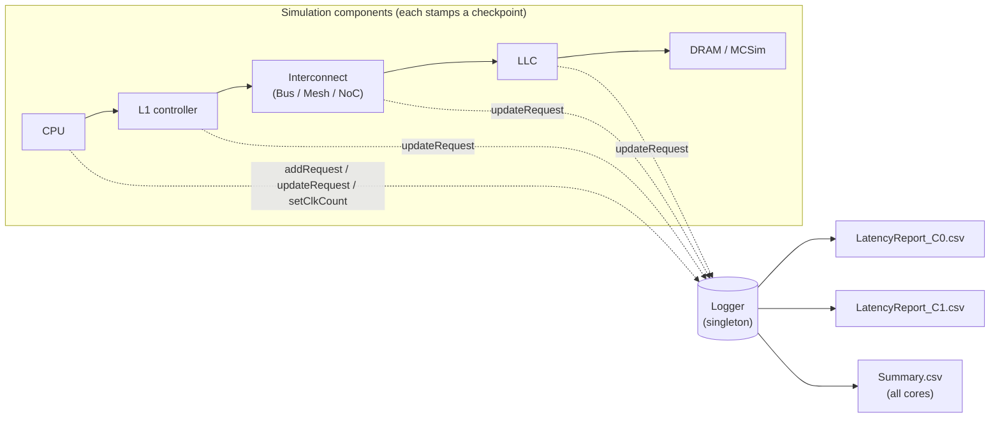
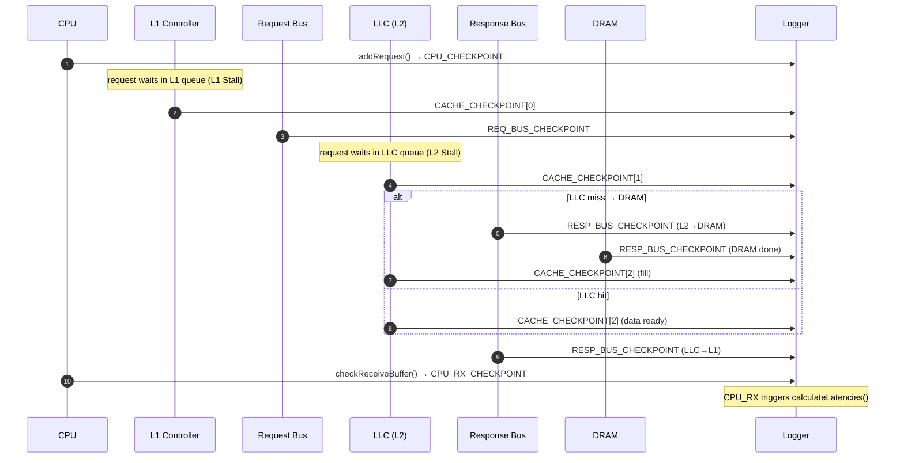
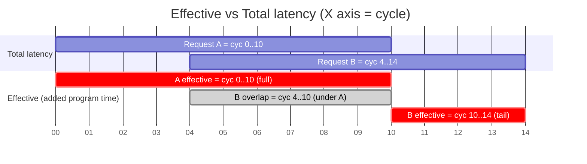
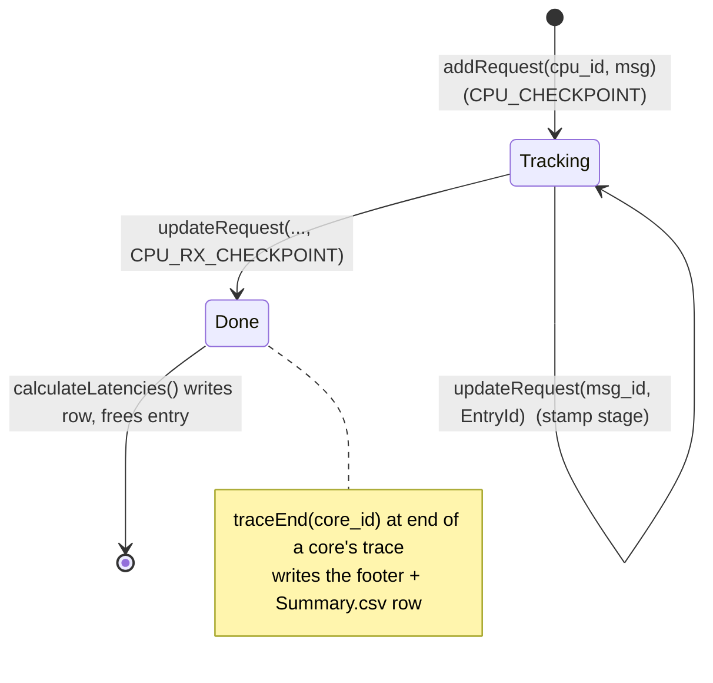

# Octopus Monitoring — The Logger (Latency Logging)

> Source: [`header/Logger.h`](../header/Logger.h), [`src/Logger.cpp`](../src/Logger.cpp)

The **Logger** is one of Octopus's two monitoring facilities (the other is the
[Debugger](Debugger.md)). It performs **latency logging**: it silently tracks
*every* message throughout its traversal of the simulated memory hierarchy and,
when a message completes, decomposes its end‑to‑end latency into the individual
stages it passed through. At the end of simulation it emits, per CPU, a detailed
per‑request report plus worst‑case and average statistics, and a single
cross‑core `Summary.csv`.

It is designed to answer two questions at once:
- **Performance:** what is the average memory latency / total execution time?
- **Real‑time / predictability:** what is the **worst‑case** latency incurred at
  each individual stage (bus, LLC, DRAM, …)?

---

## 1. Design at a glance



The Logger is a **singleton** obtained via `Logger::getLogger()`, so every
component in the system talks to the same instance. Components never format
report rows themselves — they only **stamp timestamps** ("checkpoints") as a
message passes through, and the Logger turns those timestamps into latencies.

---

## 2. The checkpoint model

Each in‑flight message is keyed by its `msg_id`. `log_entries[msg_id]` is an
**array of 9 vectors** — one slot per `EntryId`:

```
CPU_ID · REQ_ID · REQ_ADDRESS · TRACE_CYCLE          <- identity (set once)
CPU_CHECKPOINT · CACHE_CHECKPOINT · REQ_BUS_CHECKPOINT
· RESP_BUS_CHECKPOINT · CPU_RX_CHECKPOINT             <- timestamps (stamped in-flight)
```

The last five are **timestamps** written as the message travels. Each is a
**vector** (`push_back`), *not* a scalar — because in a multi‑level hierarchy a
message crosses the same *kind* of stage more than once (e.g. it is serviced at
L1 **and** at L2, both under `CACHE_CHECKPOINT`; a miss crosses the response bus
several times). The number of stamps in a slot is later used to **infer the
path** the message took (see §5).

### Where each checkpoint is stamped

| `EntryId` | Stamped by | Event |
|-----------|-----------|-------|
| `CPU_CHECKPOINT` | `CPU::addRequest` | request issued by the core |
| `CACHE_CHECKPOINT` | `BaseController` / `CacheController` | serviced at a cache level — **once per level** (L1, then L2 …) |
| `REQ_BUS_CHECKPOINT` | `BusController` / `MeshController` / `NoCController` | crossed the **request** bus |
| `RESP_BUS_CHECKPOINT` | same interconnects | crossed the **response** bus — **multiple** stamps on the L2‑miss/DRAM path |
| `CPU_RX_CHECKPOINT` | `CPU::checkReceiveBuffer` | response delivered back to the core |

---

## 3. A message's journey



Each arrow to `LOG` is a call to `updateRequest(msg_id, EntryId)` (or
`addRequest` for the first one). The Logger records **the current cycle** at
each arrow — see the clock trick below.

---

## 4. The clock‑domain trick

Every cycle, `CPU::cycleProcess` calls:

```cpp
Logger::getLogger()->setClkCount(core_id, m_clk_cycle);   // core_clk_count[core_id] = now
```

So `core_clk_count[core_id]` always holds *that core's* current cycle. When
**any** component stamps a checkpoint, `updateRequest` records
`core_clk_count[core_id]` (looked up from the message's `CPU_ID`). The result:
**all latencies for a message are measured in its originating core's clock**, no
matter which component (bus, LLC, DRAM) does the stamping. No per‑component clock
bookkeeping is needed.

---

## 5. Path inference from vector sizes

The Logger does not need components to announce "this was an L2 miss." It infers
the path from **how many times** each stage was stamped:

- `CACHE_CHECKPOINT.size() == 3` → the request reached the **LLC** (L1, L2, fill),
  vs `1` for an **L1 hit**.
- `RESP_BUS_CHECKPOINT.size() > 1` → the request went to **DRAM** (extra
  response‑bus crossings for the L2→DRAM and DRAM→L2 legs).

`calculateLatencies` branches on these sizes to pick the correct pair of
checkpoints for each stage's difference.

---

## 6. Latency decomposition (per‑request row)

The moment `CPU_RX_CHECKPOINT` is stamped, `updateRequest` calls
`calculateLatencies(msg_id)`, which writes one CSV row of **consecutive‑checkpoint
differences** (all clamped to ≥ 0 by `writeLatency`). Columns:

```
RequestID, Request Address, Trace Cycle,
CPU, L1-Stall, Request-Bus, L2-Stall, L2-Access,
Response-Bus, L2-DRAM-Bus, DRAM, Total, Effective
```

| Column | Definition |
|--------|-----------|
| **CPU** | `CPU_CHECKPOINT − TRACE_CYCLE` (issue vs the trace's compute timestamp) |
| **L1‑Stall** | `CACHE[0] − CPU_CHECKPOINT` — time queued in L1 before service |
| **Request‑Bus** | `REQ_BUS − CACHE[0]` |
| **L2‑Stall** | `CACHE[1] − REQ_BUS` |
| **L2‑Access** | LLC hit: `CACHE[2] − CACHE[1]`; LLC miss: `CACHE[2] − RESP_BUS[1]`; L1 hit: `0` |
| **Response‑Bus** | hit: `RESP_BUS[0] − REQ_BUS`; miss: `RESP_BUS[2] − RESP_BUS[1]` |
| **L2‑DRAM‑Bus** | miss: `RESP_BUS[0] − CACHE[1]`; else `0` |
| **DRAM** | miss: `RESP_BUS[1] − RESP_BUS[0]`; else `0` |
| **Total** | `CPU_RX − CPU_CHECKPOINT` (true end‑to‑end) |
| **Effective** | `CPU_RX − max(prev_request_finish, CPU_CHECKPOINT)` (see §7) |

Visually, the stages tile the message's lifetime (note `Total` starts at
`CPU_CHECKPOINT`, **not** `TRACE` — the leading `CPU` interval is reported
separately):

```
 TRACE    CPU_CP     CACHE[0]    REQ_BUS    CACHE[1]      ...        CPU_RX
   |--CPU-->|--L1Stall-->|--ReqBus-->|--L2Stall-->|--- ... --->|--RespBus-->|
            |<------------------------- Total -------------------------->|

   CPU      = CPU_CP  - TRACE          (reported, but outside Total)
   Total    = CPU_RX  - CPU_CP         (end-to-end from issue)
```

---

## 7. Effective latency (memory‑level parallelism aware)

**Total** double‑counts latency when requests overlap (out‑of‑order / multiple
outstanding). **Effective** fixes this:

```cpp
effective = CPU_RX − max(last_checkpoint[core], CPU_CHECKPOINT);
last_checkpoint[core] = CPU_RX;   // advance the "program clock"
```

Only the portion of a request that does **not** overlap the previous request's
completion counts toward program time. Summing Effective latencies therefore
approximates the true **added execution time**, correctly crediting overlapped
(parallel) memory accesses. The per‑core **Average Latency** is the mean of
Effective, and `max_effective_latency` its worst case.



**Red = effective** (the added program time): **A's full 0..10**, and **B's tail
10..14 only**. **Grey = B's 4..10 overlap**, already counted under A and therefore
**not** recounted. So `EffA + EffB = 10 + 4 = 14` (the real wall‑clock span 0..14),
whereas `ΣTotals = 10 + 10 = 20` over‑counts the 6‑cycle overlap — exactly what
`effective = CPU_RX − max(prev_finish, issue)` prevents.

The **red (`crit`)** bars are the true effective contributions — **A's full
0..10** and **B's tail 10..14 only**. The **grey (`done`)** bar is B's 4..10
overlap, which is already counted under A and therefore **not recounted**. Hence
`EffA + EffB = 10 + 4 = 14` (the real wall‑clock span 0..14), whereas
`ΣTotals = 10 + 10 = 20` over‑counts the 6‑cycle overlap. This is exactly
`effective = CPU_RX − max(prev_finish, issue)` — summing Effective (not Total)
recovers the true added runtime.

---

## 8. Reports produced

### Per‑core `LatencyReport_C{id}.csv`
Header + one row per completed request + a blank gap + **two footer rows**: the
worst‑case (max) of every column, and the average. Example shape:

```
RequstID,Request Address,Trace Cycle,CPU Latency,L1 Stall Latency,...,Total Latency,Effective Latency
0,7f..a0,12,3,0,2,...,41,41
1,7f..a8,15,3,0,2,...,7,4
...

Worst-case L1 Stall Latency,Worst-case Requst Bus Latency,...,Worst-case Total Latency,Worst-case Effective Latency,Average Latency
0,6,4,25,...,94,88,12.7
```

### Cross‑core `Summary.csv`
One row per core with every worst‑case component + average + **Finish Cycle**
(the cycle its last request retired = its total execution time):

```
Core Id,Worst-case L1 Stall Latency,...,Worst-case Total Latency,Worst-case Effective Latency,Average Latency,Finish Cycle
0,0,6,...,94,88,12.7,1146909
1,...
```

`Summary.csv` is the natural machine‑readable hook for **configuration sweeps**:
it exposes, per config, the WCET of each stage (showing *where* a knob acts —
bus arbiter → Request/Response‑Bus WCET, memory → DRAM WCET, cache geometry →
L2‑Access/Stall), the average, and the runtime.

---

## 9. Worst‑case (WCET) tracking

`logMax(latency, &worst_case_X[core])` updates a per‑core, per‑stage running
maximum on every completed request. This gives, for free, the **observed
worst‑case latency of each individual pipeline stage** — the quantity real‑time
analysis needs, and something aggregate simulators typically do not expose.

---

## 10. Lifecycle & API



| Method | Role |
|--------|------|
| `getLogger()` | singleton accessor |
| `registerReportPath(path)` | where the CSVs are written (`<workload>/newLogger/`) |
| `setClkCount(core, clk)` | called every cycle; establishes the core clock |
| `addRequest(cpu_id, msg)` | begin tracking a message; stamps `CPU_CHECKPOINT` |
| `updateRequest(msg_id, EntryId)` | stamp a stage; `CPU_RX` triggers `calculateLatencies` |
| `traceEnd(core_id)` | emit the core's footer + its `Summary.csv` row |

---

## 11. Engineering details

- **Memory‑lean:** a message's `log_entries` slot is `delete[]`'d the instant it
  completes, so only *in‑flight* messages consume memory.
- **`OCTOPUS_NO_LOG=1`:** skips per‑request logging (heap alloc + row write) but
  still registers cores and emits `Summary.csv` completion — for **correctness
  sweeps** where only successful termination matters, not latency.
- **Robustness:** `updateRequest` ignores unknown `msg_id`s (e.g. replacement
  requests or messages generated at shared memory), and `writeLatency` clamps
  negative differences to 0.

---

## 12. Relationship to the Debugger

The Logger is **automatic, global, fixed‑format** — it answers *"how long, and
worst case?"* for every message. The [Debugger](Debugger.md) is **opt‑in,
per‑component, filterable, free‑format** — it answers *"what exactly happened to
this message / at this component?"* Use the Logger for metrics and WCET; use the
Debugger to trace a specific address or coherence event.
